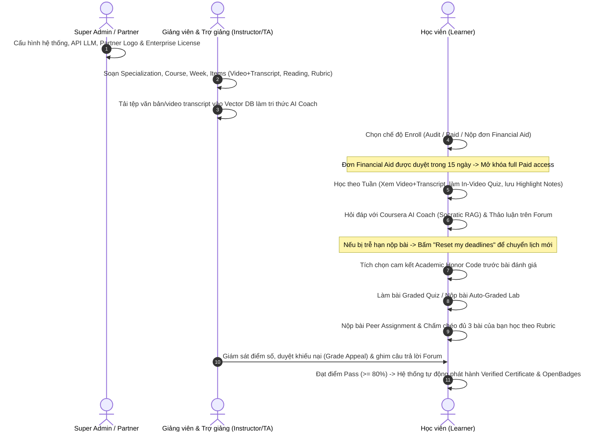

# 01. TỔNG QUAN NGHIỆP VỤ & PHÂN BỔ VAI TRÒ (COURSERA-STYLE PLATFORM)

Dự án phát triển **Hệ thống Quản lý Học tập Trực tuyến Chuẩn Coursera (Coursera-style LMS)** tích hợp **Trợ lý AI (Coursera AI Coach)**. Hệ thống cung cấp trải nghiệm học tập đa tầng chất lượng cao, kết hợp các dạng bài học đa phương tiện (Video kèm Phụ đề & Interactive Transcript, In-Video Quiz, Bài đọc, Practice/Graded Quiz, Auto-Graded Lab, Peer Review Assignment), Diễn đàn thảo luận bám sát bài học, và Trợ lý AI Coach hỗ trợ tự học theo phương pháp gợi mở (Socratic Method).

---

## 1. Các Tác Nhân trong Hệ Thống (Roles & Personas)

Hệ thống được vận hành và tương tác bởi 4 vai trò cốt lõi:

1. **Super Admin (Platform Admin - Quản trị nền tảng):**
   * Quản lý tài khoản người dùng toàn hệ thống (phê duyệt, khóa, phân quyền).
   * Quản lý các gói suất học doanh nghiệp/trường học (Enterprise License & Seat Assignment).
   * Xét duyệt đơn Hỗ trợ tài chính (Financial Aid) cấp cao hoặc tự động hóa quy tắc phê duyệt.
   * Giám sát chi phí API LLM, lưu lượng Vector Database và hiệu năng hệ thống thời gian thực.
   * Cấu hình kỹ thuật các dịch vụ ngoài (LLM API Key, Vector Database, Cloud Storage) và quản lý danh sách Báo cáo vi phạm (Abuse Reporting Queue).

2. **Giảng viên & Trợ giảng (Instructor & Teaching Assistant - TA):**
   * Xây dựng cấu trúc học tập chuẩn Coursera: Specialization (Chuyên ngành) -> Course (Khóa học) -> Module / Week (Tuần học) -> Lesson -> Learning Items.
   * Đăng tải học liệu đa dạng: Video bài giảng kèm Phụ đề (.vtt), Interactive Transcript, Bài đọc (Reading), Quiz ôn luyện (Practice Quiz), và In-Video Quiz (câu hỏi ngắt ngang video).
   * Cấu hình bài thi tính điểm (Graded Quiz), bài tập lập trình tự động chấm (Auto-Graded Lab), và bài tập nộp dự án (Peer-Graded Assignment) kèm Bộ tiêu chí chấm điểm (Rubric).
   * Cung cấp học liệu đầu vào tự động xây dựng Cơ sở tri thức (Knowledge Base RAG) cho Trợ lý AI Coach.
   * Xét duyệt đơn Hỗ trợ tài chính (Financial Aid) của học viên cho khóa học mình quản lý.
   * Đóng vai trò điều phối Diễn đàn thảo luận (Discussion Forum): Trả lời thắc mắc, ghim câu trả lời chuẩn (Staff Answer Pinning).
   * Theo dõi báo cáo tiến độ, bảng điểm, và nhật ký vi phạm Guardrails của học viên.

3. **Đối tác Phát hành (Partner / Organization Admin):**
   * Đại diện cho các Trường Đại học hoặc Doanh nghiệp đối tác phát hành khóa học (ví dụ: Stanford, DeepLearning.AI, Google...).
   * Quản lý thương hiệu đối tác, Logo và chữ ký xác thực hiển thị trên trang giới thiệu khóa học và Chứng chỉ xác minh (Verified Certificate).
   * Giám sát chỉ số hoàn thành chương trình đào tạo và thống kê chứng chỉ được cấp thuộc tổ chức.

4. **Học viên (Learner / Student):**
   * Đăng ký tham gia khóa học theo 4 chế độ: Audit Mode (Học thử/Miễn phí), Single Purchase / Subscription (Trả phí), Financial Aid (Nộp đơn xin học bổng), hoặc Enterprise License (Suất học do tổ chức tài trợ).
   * Tự học theo lộ trình tuần (Weekly Schedule), trải nghiệm bài học với Video kèm Phụ đề/Interactive Transcript, In-Video Quiz, Bài đọc, và Highlight/Lưu ghi chú cá nhân (Notes).
   * Sử dụng tính năng **"Reset my deadlines"** khi gặp sự cố trễ hạn nộp bài để chuyển sang đợt học mới mà không bị phạt điểm.
   * Tương tác với Trợ lý AI Coach (Coursera AI Coach) để tóm tắt nội dung transcript, giải thích khái niệm theo phương pháp gợi mở (Socratic Method), và sinh bài tập phản xạ.
   * Thảo luận, đặt câu hỏi và Upvote/Downvote trên Diễn đàn thảo luận (Discussion Forum) bám sát từng bài học.
   * Cam kết Liêm chính học thuật (Academic Honor Code) và hoàn thành các bài đánh giá năng lực: Graded Quiz, Auto-Graded Lab, Nộp bài dự án & Chấm chéo 3 bài của bạn học (Peer Review).
   * Nhận Chứng chỉ xác minh (Verified Certificate) có Mã xác thực công khai / QR code và Huy hiệu số OpenBadges để chia sẻ trực tiếp lên hồ sơ LinkedIn.

---

## 2. Sơ đồ Phối hợp Nghiệp vụ Tổng thể (Workflow Sequence)

Quy trình phối hợp giữa các vai trò trong một chu kỳ học tập chuẩn Coursera được mô tả qua sơ đồ dưới đây:

