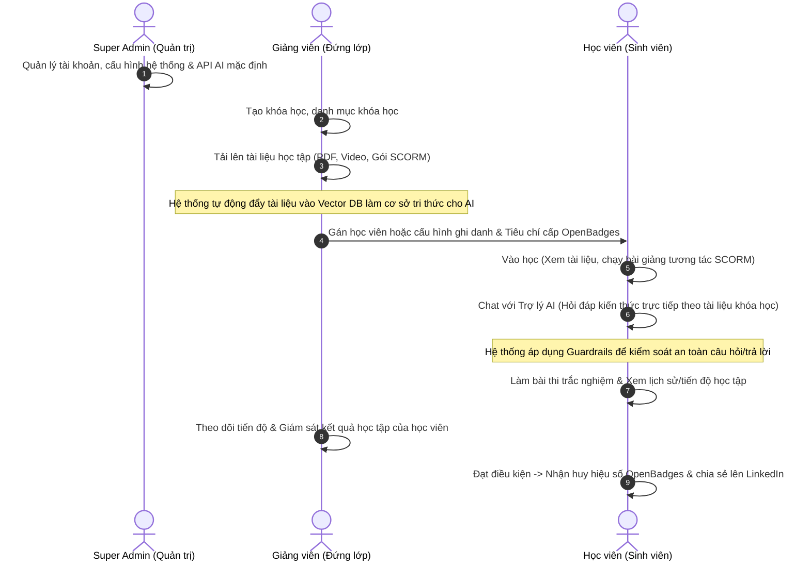

# 01. TỔNG QUAN NGHIỆP VỤ & PHÂN BỔ VAI TRÒ

Dự án phát triển **Hệ thống quản lý học tập trực tuyến (LMS) tích hợp Trợ lý AI hỗ trợ học tập**. Hệ thống này cung cấp môi trường học tập tương tác cao, kết hợp tài liệu truyền thống, bài học tương tác chuẩn SCORM và Trợ lý AI hỏi đáp tức thời theo ngữ cảnh khóa học.

---

## 1. Các Tác Nhân trong Hệ Thống (Roles & Personas)

Hệ thống được vận hành và tương tác bởi 3 vai trò cốt lõi:

1.  **Super Admin (Quản trị viên hệ thống):** 
    *   Chịu trách nhiệm quản lý tài khoản người dùng toàn hệ thống (phê duyệt, khóa, phân quyền).
    *   Giám sát hoạt động, đo lường chi phí sử dụng API LLM và kiểm tra tải hệ thống.
    *   Cấu hình kỹ thuật các tham số kết nối dịch vụ ngoài (LLM API Key, Vector Database, Cloud Storage).
    *   Giám sát chất lượng giảng dạy chung và tiếp nhận, xử lý các báo cáo vi phạm chính sách.

2.  **Giảng viên (Teacher):**
    *   Xây dựng cấu trúc danh mục và nội dung khóa học.
    *   Đăng tải học liệu đa dạng (PDF, Video, gói bài giảng tương tác SCORM) để tự động hóa việc xây dựng Cơ sở tri thức (Knowledge Base) cho Trợ lý AI.
    *   Hỗ trợ học viên trực tiếp qua các cuộc hẹn Google Meet 1-1 theo yêu cầu.
    *   Giám sát tiến độ học tập, điểm thi và lịch sử hội thoại của học viên với AI để kịp thời cải tiến bài giảng.

3.  **Học viên (Student):**
    *   Tham gia các khóa học được chỉ định (mô hình học thuật nội bộ) hoặc tự ghi danh bằng cách mua khóa học/sử dụng mã kích hoạt (mô hình thương mại).
    *   Tự học qua video, tài liệu và tương tác trực tiếp với slide bài giảng SCORM.
    *   Sử dụng Trợ lý AI (RAG Chatbot) để hỏi đáp kiến thức bám sát nội dung bài học mọi lúc mọi nơi.
    *   Gửi yêu cầu hỗ trợ 1-1 đến giảng viên khi gặp khó khăn và đánh giá chất lượng hỗ trợ sau buổi hẹn.
    *   Làm các bài thi trắc nghiệm đánh giá năng lực, nhận và chia sẻ Huy hiệu số (OpenBadges) khi đạt tiêu chuẩn hoàn thành khóa học.

---

## 2. Sơ đồ Phối hợp Nghiệp vụ Tổng thể (Workflow Sequence)

Quy trình phối hợp giữa 3 vai trò trong một chu kỳ học tập tích hợp AI được mô tả qua sơ đồ dưới đây:

