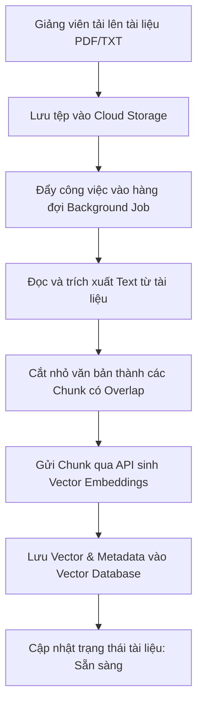

# 03. ĐẶC TẢ CHI TIẾT CÁC CHỨC NĂNG NGHIỆP VỤ

Tài liệu này đặc tả chi tiết và chuyên sâu các yêu cầu chức năng cho từng tác nhân (Super Admin, Giảng viên, Học viên) trong hệ thống. Đây là cơ sở để thiết kế giao diện (UI/UX) và lập trình các luồng xử lý của ứng dụng.

---

## 1. VAI TRÒ: SUPER ADMIN (QUẢN TRỊ HỆ THỐNG)

### 1.1. Quản lý tài khoản người dùng (User Management)
*   **Thêm mới tài khoản:** Admin có thể tạo tài khoản đơn lẻ hoặc import hàng loạt từ file Excel (`.xlsx`, `.csv`) với các trường: `Họ tên`, `Email` (duy nhất), `Số điện thoại`, `Vai trò` (Teacher/Student), `Mã số (MSV/MGV)`.
*   **Phê duyệt đăng ký:** Phê duyệt hoặc từ chối các yêu cầu đăng ký tài khoản tự do của học viên (nếu bật chế độ phê duyệt thủ công).
*   **Khóa/Kích hoạt tài khoản:** Tạm khóa tài khoản vi phạm chính sách hoặc kích hoạt lại. Khi tài khoản bị khóa, mọi phiên đăng nhập (session) của người dùng đó sẽ bị thu hồi lập tức.
*   **Phân quyền (RBAC):** Chỉ định vai trò và phạm vi quản lý (ví dụ: Giảng viên thuộc khoa/bộ môn nào).

### 1.2. Giám sát hệ thống (System Monitoring Dashboard)
*   **Thống kê thời gian thực:** Số lượng người dùng trực tuyến (Active Users), số lượng khóa học hiện hành, tổng dung lượng học liệu đã tải lên.
*   **Giám sát API LLM:** Thống kê số lượng Token đã tiêu thụ (Prompt Tokens, Completion Tokens), chi phí ước tính, và tỷ lệ lỗi API theo ngày/tháng.
*   **Báo cáo tải hệ thống:** Tải CPU, dung lượng RAM, dung lượng lưu trữ đĩa và lưu lượng mạng của máy chủ chứa mã nguồn và Vector DB.

### 1.3. Cấu hình kỹ thuật hệ thống (System Configurations)
*   **Cấu hình API LLM:** Giao diện nhập và kiểm tra (Test Connection) API Key cho Gemini. Thiết lập Model mặc định (ví dụ: `gemini-1.5-flash`, `gemini-1.5-pro`).
*   **Cài đặt tham số LLM:** Cấu hình `Temperature` (độ sáng tạo, mặc định `0.2` để đảm bảo độ chính xác học thuật), `Max Output Tokens`, `Top-P`, `Top-K`.
*   **Cấu hình Vector DB:** Địa chỉ kết nối (URL), API Key và tên Index của Vector Database.
*   **Cài đặt lưu trữ:** Cấu hình liên kết Cloud Storage (Google Cloud Storage) để lưu trữ tệp tin tĩnh và gói SCORM.

### 1.4. Quản lý chất lượng & Báo cáo vi phạm (Quality Control & Abuse Management)
*   **Giám sát hiệu quả hỗ trợ 1-1 (SLA & CSAT Metrics):**
    *   Theo dõi thời gian phản hồi trung bình (SLA) của từng giảng viên (từ lúc học viên tạo yêu cầu hỗ trợ đến lúc giảng viên xếp lịch và hoàn thành).
    *   Tổng hợp điểm số hài lòng trung bình (CSAT) của giảng viên dựa trên số sao học viên đánh giá.
*   **Quản lý danh sách Báo cáo vi phạm (Abuse Reporting Queue):**
    *   Tiếp nhận và lưu trữ danh sách các báo cáo từ học viên về chất lượng bài học hoặc giảng viên (bỏ bê hỗ trợ, nội dung học liệu sai sót hoặc phản cảm).
    *   *Hành động xử lý:* Gửi email cảnh báo tự động, ẩn tạm thời khóa học bị báo cáo (chuyển về trạng thái Bản nháp), hoặc tạm khóa tài khoản của giảng viên vi phạm chính sách để điều tra.

---

## 2. VAI TRÒ: GIẢNG VIÊN (TEACHER)

### 2.1. Quản lý khóa học & Danh mục (Course & Category Management)
*   **Quản lý danh mục:** Tạo, sửa, xóa danh mục khóa học (ví dụ: CNTT, Ngôn ngữ, Kinh tế) để phân loại.
*   **Quản lý khóa học:** Tạo mới khóa học với các trường thông tin: `Tên khóa học`, `Mã khóa học`, `Mô tả ngắn`, `Ảnh đại diện`, `Mức giá` (Miễn phí / Trả phí), `Trạng thái` (Bản nháp / Xuất bản / Đóng).
*   **Cơ chế Ghi danh & Phân quyền truy cập (Enrollment & Access Control):**
    *   *Mô hình Học thuật (Academic/Internal):* Giảng viên hoặc Admin import danh sách sinh viên theo lớp học để gán vào khóa học. Học viên chỉ cần đăng nhập là thấy khóa học được chỉ định.
    *   *Mô hình Thương mại (Commercial/B2C):* Khóa học có giá bán. Học viên tự đăng ký và thanh toán để hệ thống tự động ghi danh. Giảng viên không có quyền tự ý gán trực tiếp học viên để ngăn chặn giao dịch ngầm bên ngoài hệ thống.
    *   *Mã mời/Coupon (Redeem Code):* Giảng viên sinh mã kích hoạt hoặc giảm giá 100% (sau khi được Admin duyệt) để tặng học bổng hoặc thử nghiệm. Học viên nhập mã này để vào học.

### 2.2. Quản lý Bài học & Học liệu (Learning Material & Knowledge Base Building)
*   **Thiết lập cấu trúc chương mục:** Tạo các Chương (Module) -> Bài học (Lesson).
*   **Tải lên tài liệu:**
    *   Tài liệu đọc: PDF, DOCX, TXT.
    *   Tài liệu đa phương tiện: Video (MP4, liên kết YouTube).
    *   Tài liệu tương tác: Gói **SCORM 1.2 / SCORM 2004** (file `.zip`).
*   **Tiến trình xây dựng Tri thức AI (RAG Pipeline):**
    1.  Khi giảng viên tải lên một file tài liệu đọc (PDF/TXT), hệ thống lưu file gốc.
    2.  Hệ thống kích hoạt tiến trình nền: Trích xuất văn bản -> Chia nhỏ văn bản -> Vector hóa (Embedding qua Gemini API) -> Lưu vector kèm metadata (`course_id`, `lesson_id`, v.v.) vào Vector DB.
    3.  Cập nhật trạng thái tri thức: Hiển thị trạng thái của tài liệu (`Đang xử lý` -> `Sẵn sàng làm tri thức AI` hoặc `Lỗi xử lý`).
*   **Quản lý tri thức:** Giảng viên xem danh sách các nguồn tài liệu đang làm dữ liệu nền cho AI trong khóa học, bật/tắt tạm thời hoặc xóa nguồn tri thức đó.



### 2.3. Hỗ trợ học viên 1-1 qua Google Meet
*   **Tiếp nhận yêu cầu:** Hiển thị danh sách các yêu cầu hỗ trợ từ học viên kèm theo mô tả vấn đề và khóa học liên quan.
*   **Lên lịch hẹn:** Giảng viên chọn một yêu cầu, nhập thông tin: `Thời gian bắt đầu`, `Thời gian kết thúc`, và `Đường dẫn Google Meet`.
*   **Xác nhận và Hoàn thành:** Sau buổi hỗ trợ, giảng viên cập nhật trạng thái yêu cầu sang `Đã hoàn thành` và ghi chú tóm tắt nội dung giải pháp.

### 2.4. Theo dõi & Giám sát học viên (Learning Analytics & Guardrail Monitoring)
*   **Báo cáo tiến độ lớp học:** Thống kê tỷ lệ hoàn thành khóa học của từng học viên, thời gian truy cập trung bình, số lượng bài học đã hoàn thành.
*   **Bảng điểm:** Xem điểm số các bài kiểm tra trắc nghiệm, số lần thi lại.
*   **Giám sát hội thoại AI (AI Chat Audit Log):**
    *   Giảng viên xem lịch sử chat giữa học viên và Trợ lý AI trong phạm vi khóa học mình quản lý.
    *   Hệ thống gắn cờ (Flagged) các cuộc hội thoại chứa câu hỏi/câu trả lời bị kích hoạt bởi Guardrails (vi phạm từ ngữ, hỏi lạc đề hệ thống phải từ chối). Giảng viên dựa vào đây để đánh giá lỗ hổng kiến thức hoặc hành vi của học viên.

---

## 3. VAI TRÒ: HỌC VIÊN (STUDENT)

### 3.1. Giao diện Học tập & Trình phát bài giảng (Learning Player & SCORM Runtime)
*   **Trình xem học liệu:**
    *   Xem video bài giảng (hỗ trợ lưu vị trí đang xem dở).
    *   Đọc tài liệu PDF trực tiếp trên trình duyệt.
*   **Trình phát gói bài giảng SCORM (SCORM Player):**
    *   Hệ thống render gói SCORM thông qua thẻ `<iframe>`.
    *   Khởi tạo đối tượng API JavaScript chuẩn SCORM (đối tượng `API` cho SCORM 1.2 hoặc `API_1484_11` cho SCORM 2004) trên cửa sổ cha để gói bài giảng trong iframe gọi tới.
    *   Lắng nghe và xử lý các hàm: `LMSInitialize()`, `LMSSetValue("cmi.core.lesson_location", value)` để lưu vị trí slide, `LMSSetValue("cmi.core.lesson_status", "completed")` để ghi nhận hoàn thành, `LMSCommit()`, `LMSFinish()`.
*   **Ghi nhận tiến trình:** Tự động đánh dấu hoàn thành bài học khi học viên thỏa mãn điều kiện (ví dụ: xem hết 90% thời lượng video, hoặc gói SCORM trả về trạng thái `completed`).

### 3.2. Trợ lý AI hỗ trợ học tập (RAG-based AI Assistant)
*   **Giao diện Chat:** Khung chat nổi (Floating Chatbox) hoặc Sidebar tích hợp sẵn trong màn hình học tập.
*   **Cơ chế RAG (Retrieval-Augmented Generation):**
    1.  Học viên nhập câu hỏi.
    2.  Hệ thống nhận câu hỏi, thực hiện vector hóa bằng model Embedding.
    3.  Hệ thống truy vấn Vector DB để tìm kiếm các văn bản (Chunks) có độ tương đồng cao nhất, **giới hạn phạm vi theo `course_id` của khóa học hiện tại**.
    4.  Tạo Prompt tổng hợp gửi đến Gemini LLM (chỉ trả lời dựa trên ngữ cảnh được cung cấp).
    5.  Nhận phản hồi từ Gemini và hiển thị dạng stream cho học viên.
*   **Hệ thống Guardrails (Bộ lọc an toàn và phạm vi):**
    *   *Bộ lọc đầu vào (Input Guard):* Quét câu hỏi của học viên xem có chứa từ ngữ độc hại, nhạy cảm hoặc có hành vi tấn công prompt (Prompt Injection) hay cố tình hỏi ngoài phạm vi học tập.
    *   *Bộ lọc đầu ra (Output Guard):* Quét câu trả lời của AI trước khi hiển thị cho học viên nhằm hạn chế hiện tượng ảo tưởng (Hallucination) - đảm bảo thông tin trả lời nằm trong tài liệu học tập được cung cấp, không chứa thông tin sai lệch hay ngôn từ không phù hợp.

```
        [Học viên đặt câu hỏi]
                 │
                 ▼
       ┌───────────────────┐
       │   Input Guard     │ ───► Vi phạm ──► [Từ chối & Ghi log]
       └───────────────────┘
                 │
                 ▼ Vượt qua
       ┌───────────────────┐
       │  RAG Retrieval    │ (Truy xuất chunks từ Vector DB theo Course ID)
       └───────────────────┘
                 │
                 ▼
       ┌───────────────────┐
       │   Gemini LLM      │ (Sinh câu trả lời dựa trên ngữ cảnh học liệu)
       └───────────────────┘
                 │
                 ▼
       ┌───────────────────┐
       │   Output Guard    │ ───► Hallucination/Độc hại ──► [Sinh lại/Thông báo lỗi]
       └───────────────────┘
                 │
                 ▼ Vượt qua
        [Hiển thị câu trả lời]
```

### 3.3. Yêu cầu hỗ trợ 1-1
*   **Tạo yêu cầu hỗ trợ:** Học viên điền biểu mẫu gồm: `Tiêu đề`, `Mô tả chi tiết khó khăn`, `Đường dẫn bài học gặp lỗi`.
*   **Theo dõi lịch hẹn:** Nhận thông báo khi giảng viên lên lịch hẹn hỗ trợ qua Google Meet.
*   **Đánh giá chất lượng hỗ trợ (Feedback & Rating):** Sau khi buổi hỗ trợ kết thúc, giao diện học viên hiển thị một form khảo sát bắt buộc trước khi học tiếp bài mới: Đánh giá số sao (1-5 sao), lý do, và ý kiến đóng góp.

### 3.4. Đánh giá kết quả & Nhận diện thành tích (Assessment & OpenBadges Certification)
*   **Làm bài thi trắc nghiệm:**
    *   Hiển thị danh sách câu hỏi trắc nghiệm (lấy ngẫu nhiên từ ngân hàng câu hỏi).
    *   Đồng hồ đếm ngược thời gian làm bài. Tự động nộp bài khi hết giờ.
    *   Chấm điểm tức thì và hiển thị đáp án, lời giải chi tiết.
*   **Cấp Huy hiệu số OpenBadges tự động:**
    *   *Kiểm tra điều kiện:* Khi học viên hoàn thành khóa học, hệ thống tự động kiểm tra tiêu chí đạt được (Ví dụ: Tiến độ = 100%, Điểm thi >= 8.0).
    *   *Tạo mã xác thực (Assertions):* Sinh đối tượng JSON-LD đại diện cho Huy hiệu chứa: `recipient` (email đã mã hóa SHA-256), `badge`, `issuer`, `issuedOn`, `id` (URL xác thực).
    *   *Nhúng Metadata vào ảnh (Baking OpenBadges):* Sử dụng thư viện để nhúng chuỗi JSON-LD này vào siêu dữ liệu (metadata/EXIF data) của file ảnh PNG/SVG huy hiệu.
    *   *Lưu trữ và Chia sẻ:* Học viên có thể tải file ảnh về máy hoặc bấm nút "Chia sẻ lên LinkedIn" (kèm liên kết xác thực).

### 3.5. Đánh giá khóa học & Báo cáo vi phạm (Course Review & Abuse Reporting)
*   **Đánh giá khóa học (Course Review):** Học viên có thể đánh giá tổng quan về khóa học (1-5 sao kèm theo nhận xét). Điểm đánh giá trung bình hiển thị công khai trên trang giới thiệu khóa học.
*   **Báo cáo vi phạm (Abuse Reporting/Flagging):** Học viên gửi báo cáo ẩn danh hoặc công danh trực tiếp đến Super Admin đối với một khóa học hoặc một giảng viên nếu phát hiện học liệu sai phạm hoặc giảng viên bỏ bê hỗ trợ.
