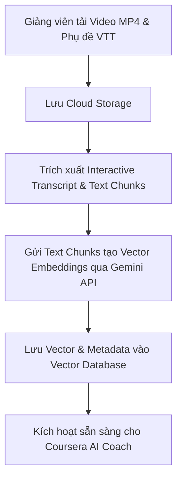

# 03. ĐẶC TẢ CHI TIẾT CÁC CHỨC NĂNG NGHIỆP VỤ (COURSERA-STYLE PLATFORM)

Tài liệu này đặc tả chi tiết và chuyên sâu các yêu cầu chức năng cho từng tác nhân (Super Admin, Giảng viên & Trợ giảng, Học viên) trên **Hệ thống Quản lý Học tập Chuẩn Coursera (Coursera-style LMS)**. Đây là cơ sở để thiết kế giao diện (UI/UX) và lập trình các luồng xử lý Backend/Frontend.

---

## 1. VAI TRÒ: SUPER ADMIN (QUẢN TRỊ NỀN TẢNG)

### 1.1. Quản lý tài khoản & Doanh nghiệp (User & Enterprise Seat Management)
* **Thêm mới & Phân quyền:** Admin tạo tài khoản hoặc import danh sách hàng loạt (`.xlsx`, `.csv`). Phân quyền các vai trò: `Learner`, `Instructor`, `TA (Teaching Assistant)`, `Partner Admin`.
* **Quản lý Suất học Doanh nghiệp (Enterprise License):**
  * Tạo gói suất học cho đối tác (ví dụ: cấp 500 seats cho Trường Đại học X hoặc Công ty Y).
  * Quản lý mã kích hoạt (Enterprise Key) và theo dõi số lượng seat đã được kích hoạt.
* **Khóa/Kích hoạt tài khoản:** Tạm khóa tài khoản vi phạm điều khoản. Thu hồi tức thì phiên làm việc (Session) của tài khoản bị khóa.

### 1.2. Giám sát hệ thống & API LLM (System & LLM Monitoring Dashboard)
* **Thống kê thời gian thực:** Số lượng người dùng trực tuyến (Active Learners), số lượng khóa học hiện hành, tổng dung lượng video/tài liệu.
* **Giám sát API LLM:** Thống kê số lượng Token tiêu thụ (Prompt Tokens, Completion Tokens), chi phí ước tính (USD), và tỷ lệ lỗi API theo ngày/tháng.
* **Báo cáo tài nguyên:** Tải CPU, RAM, lưu lượng mạng của hệ thống web server, Auto-Grader sandbox server và Vector Database.

### 1.3. Cấu hình kỹ thuật hệ thống (System Configurations)
* **Cấu hình API LLM:** Giao diện nhập và kiểm tra (Test Connection) API Key cho Gemini LLM. Cấu hình model mặc định (`gemini-1.5-flash`, `gemini-1.5-pro`).
* **Cài đặt tham số LLM:** Cấu hình `Temperature` (mặc định `0.2` để đảm bảo độ chính xác học thuật), `Max Output Tokens`, `Top-P`, `Top-K`.
* **Cấu hình Vector DB & Cloud Storage:** Địa chỉ kết nối Vector Database (Index Name, API Key) và Google Cloud Storage cho video/phụ đề.

### 1.4. Quản lý chất lượng & Báo cáo vi phạm (Quality Control & Abuse Management)
* **Giám sát chỉ số CSAT:** Tổng hợp điểm số hài lòng trung bình (1-5 sao) và tỷ lệ hoàn thành (Completion Rate) của từng khóa học.
* **Quản lý Báo cáo vi phạm (Abuse Queue):**
  * Tiếng nhận các báo cáo từ học viên về nội dung bài giảng bị lỗi/phản cảm hoặc gian lận điểm số.
  * *Hành động:* Gửi email nhắc nhở Giảng viên, ẩn tạm thời bài học (chuyển về trạng thái Nháp) hoặc thu hồi chứng chỉ vi phạm.

---

## 2. VAI TRÒ: GIẢNG VIÊN & TRỢ GIẢNG (INSTRUCTOR / TA)

### 2.1. Quản lý Cấu trúc Học tập Coursera (Specialization & Course Management)
* **Tạo Specialization (Chuỗi Chuyên ngành):** Nhóm nhiều khóa học liên quan theo một lộ trình nghề nghiệp (ví dụ: Chuyên ngành *Lập trình Python Nâng cao & AI* bao gồm 4 khóa học thành phần).
* **Cấu trúc Khóa học (Course Hierarchy):**
  * Khóa học (Course) -> Tuần học (Module / Week) -> Bài học (Lesson) -> Các dạng bài học thành phần (Learning Items).
* **Quản lý Đơn vị Phát hành (Partner Branding):** Chọn đối tác phát hành (Partner Logo), hiển thị tên Giảng viên chính và danh sách Trợ giảng (TA).

### 2.2. Soạn thảo & Quản lý Học liệu đa dạng (Learning Items Builder)
Giảng viên xây dựng bài học bằng cách thêm các loại Learning Items:
1. **Video Item:**
   * Tải tệp Video (MP4) và tệp Phụ đề (VTT/SRT).
   * Hệ thống tự động trích xuất chuỗi văn bản tạo thành **Interactive Transcript** (cho phép bấm vào từng câu thoại để tua video đến giây tương ứng).
   * **In-Video Quiz:** Giảng viên chèn câu hỏi trắc nghiệm tại mốc thời gian cụ thể (ví dụ: tại 03:15). Khi video chạy đến mốc này sẽ tự động dừng để học viên trả lời trước khi tiếp tục.
2. **Reading Item:** Soạn thảo bài đọc nội dung Rich-text / Markdown, nhúng hình ảnh, code block và hiển thị thời gian đọc ước tính.
3. **Practice Quiz Item:** Bài tập trắc nghiệm ngắn không tính điểm, hiển thị giải thích chi tiết ngay sau mỗi câu trả lời để học viên tự ôn luyện.



### 2.3. Phân hệ Đánh giá & Chấm điểm (Assessments & Rubric Builder)
1. **Graded Quiz Builder:**
   * Ngân hàng câu hỏi trắc nghiệm (1 đáp án / Nhiều đáp án).
   * Cấu hình điểm đạt (Passing Threshold, ví dụ: 80%), thời gian làm bài đếm ngược, và Cooldown (chờ 8 tiếng nếu thi xịt 3 lần).
2. **Auto-Graded Lab Builder (Dành cho bài tập lập trình):**
   * Giảng viên tải lên bộ Test Cases và File mẫu (Starter Code).
   * Cấu hình môi trường chạy (Python, Node.js...) và giới hạn tài nguyên (Timeout, Memory Limit).
3. **Peer-Graded Assignment Builder:**
   * Giảng viên soạn đề bài nộp dự án (yêu cầu đính kèm file, văn bản hoặc link).
   * **Bộ tiêu chí Rubric:** Giảng viên chia các tiêu chí chấm điểm chi tiết (ví dụ: Tiêu chí 1: Cấu trúc code - Max 5 điểm; Tiêu chí 2: Giao diện - Max 5 điểm) kèm hướng dẫn chi tiết cho học viên chấm chéo.

### 2.4. Quản lý Diễn đàn & Duyệt Hỗ trợ tài chính (Forum & Financial Aid Review)
* **Điều phối Diễn đàn (Forum Moderation):** Trợ giảng/Giảng viên xem các bài thảo luận theo tuần, trả lời câu hỏi và bấm nút **"Staff Answer"** để ghim câu trả lời chính thức lên đầu trang.
* **Xét duyệt Financial Aid:**
  * Giảng viên xem danh sách đơn xin học bổng của học viên (gồm bài luận 150 từ giải trình hoàn cảnh và lý do học).
  * Bấm **Duyệt (Approve)** để hệ thống tự động cấp quyền Paid access cho học viên.

---

## 3. VAI TRÒ: HỌC VIÊN (LEARNER)

### 3.1. Trình phát Bài học Coursera (Course Player & Notes)
* **Giao diện Trình phát Bài học:**
  * Cột bên trái hiển thị danh sách Tuần học (Week) và danh sách Items.
  * Khung giữa phát Video / Bài đọc / Quiz.
* **Tính năng Interactive Transcript & Highlight Notes:**
  * Phụ đề cuộn tự động theo lời nói trong video. Bấm vào dòng phụ đề để nhảy đến giây video tương ứng.
  * Học viên có thể bôi đen (Highlight) từ/cụm từ trong phụ đề hoặc bài đọc để lưu lại thành **Ghi chú cá nhân (Personal Notes)**.
* **In-Video Quiz Experience:** Video tự dừng tại mốc thời gian chèn quiz. Học viên chọn đáp án và bấm "Submit" để xem giải thích và tiếp tục xem video.

### 3.2. Cơ chế Học tập Linh hoạt & Reset Deadlines (Flexible Weekly Schedule)
* **Hạn nộp linh hoạt (Flexible Deadlines):** Mỗi tuần học có hạn nộp gợi ý (Suggested Deadlines) để học viên duy trì tiến độ.
* **Tính năng "Reset My Deadlines":** Nếu học viên bận việc và quá hạn nộp bài (Overdue), màn hình khóa học sẽ xuất hiện nút **"Reset my deadlines"**. Khi bấm nút này, hệ thống sẽ tự động cập nhật lịch nộp bài sang đợt mới mà không trừ điểm thi.

### 3.3. Trợ lý AI Coursera Coach (RAG-based Socratic AI Assistant)
* **Khung chat Coursera AI Coach:** Tích hợp trực tiếp ở thanh công cụ góc phải giao diện bài học.
* **Cơ chế RAG theo Ngữ cảnh:**
  1. Học viên nhập câu hỏi (ví dụ: *"Giải thích đoạn code ở phút 02:30 của video"* hoặc *"Tóm tắt 3 ý chính của bài đọc này"*).
  2. AI Coach truy vấn Vector DB giới hạn trong phạm vi `course_id` và `lesson_id` hiện tại.
  3. Gemini LLM sinh câu trả lời theo đúng ngữ cảnh bài giảng.
* **Phương pháp Gợi mở (Socratic Method) & Anti-Cheat Guardrails:**
  * AI Coach hỗ trợ giải thích khái niệm, dịch phụ đề, tóm tắt video, sinh câu hỏi ôn tập phản xạ.
  * **Chống gian lận (Anti-Cheat):** Nếu học viên copy câu hỏi bài thi Graded Quiz hoặc bài Peer Review thả vào chat, Input Guardrail lập tức chặn và AI Coach từ chối trả lời: *"Tôi là AI Coach hỗ trợ học tập, tôi không thể cung cấp đáp án trực tiếp cho bài kiểm tra tính điểm. Bạn hãy xem lại nội dung bài đọc để tự hoàn thành bài làm nhé!"*

```
        [Học viên đặt câu hỏi cho AI Coach]
                         │
                         ▼
               ┌───────────────────┐
               │   Input Guard     │ ───► Hỏi đáp án Graded Quiz ──► [Từ chối (Socratic Guard)]
               └───────────────────┘
                         │
                         ▼ Vượt qua
               ┌───────────────────┐
               │  RAG Retrieval    │ (Truy xuất Vector chunks theo Course/Lesson ID)
               └───────────────────┘
                         │
                         ▼
               ┌───────────────────┐
               │   Gemini LLM      │ (Sinh phản hồi giải thích theo phương pháp gợi mở)
               └───────────────────┘
                         │
                         ▼
               ┌───────────────────┐
               │   Output Guard    │ ───► Kiểm soát ngôn từ & Hallucination
               └───────────────────┘
                         │
                         ▼ Vượt qua
                [Stream câu trả lời]
```

### 3.4. Diễn đàn Thảo luận theo Bài học (Discussion Forum)
* **Thảo luận gắn với Item (Item-level Discussion):** Dưới mỗi bài học video/bài đọc có mục "Discussion". Học viên gửi câu hỏi và nhận câu trả lời từ bạn học trên khắp thế giới.
* **Upvote & Staff Pinning:** Học viên có thể Upvote câu trả lời hữu ích. Các câu trả lời được Trợ giảng ghim (Staff Answer) sẽ được làm nổi bật với huy hiệu đặc biệt.

### 3.5. Phân hệ Đánh giá Năng lực (Assessments Sub-system)
* **Cam kết Liêm chính Học thuật (Academic Honor Code):** Trước khi bấm bắt đầu Graded Quiz hoặc nộp bài Peer Review, học viên phải tích vào checkbox: *"Tôi cam kết đây là bài làm độc lập của chính tôi"*.
* **Graded Quiz:** Đồng hồ đếm ngược, tự động chấm điểm và hiển thị kết quả. Nếu trượt, học viên phải đợi hết thời gian Cooldown mới được làm lại.
* **Auto-Graded Lab:** Học viên tải file code lên -> Sandbox gửi tới Auto-Grader chạy Test Cases -> Trả về danh sách Pass/Fail test cases và điểm số tức thì.
* **Peer-Graded Assignment Sub-system:**
  1. **Nộp bài:** Học viên nộp bài dự án (file/link/văn bản) trước deadline.
  2. **Chấm chéo:** Sau deadline nộp bài, hệ thống tự động phân bổ 3 bài làm của bạn học ngẫu nhiên cho học viên. Học viên đọc bài và cho điểm từng tiêu chí theo Rubric kèm lời nhận xét.
  3. **Tính điểm:** Điểm chính thức = Trung bình cộng điểm của các bạn học chấm.
  4. **Khiếu nại điểm (Grade Appeal):** Nếu học viên nhận thấy điểm chấm chéo có bất thường, học viên gửi đơn khiếu nại để Trợ giảng (TA) chấm lại thủ công.

### 3.6. Chứng nhận & Xác thực Thành tích (Verified Certificate & OpenBadges)
* **Cấp Chứng chỉ Xác minh (Verified Certificate):** Khi hoàn thành 100% bài học và đạt điểm Pass ở tất cả bài Graded items (>= 80%), hệ thống tự động phát hành Verified Certificate.
* **Mã xác minh công khai (Verification URL):** Mỗi chứng chỉ có một URL độc nhất (`/verify/CERT-xxxxx`) và mã QR code để nhà tuyển dụng truy cập kiểm tra tính hợp lệ công khai.
* **OpenBadges & LinkedIn Sharing:** Chứng chỉ được nhúng siêu dữ liệu OpenBadges 2.0. Học viên chỉ cần 1 cú nhấp chuột để chia sẻ trực tiếp thành tích lên hồ sơ LinkedIn.
