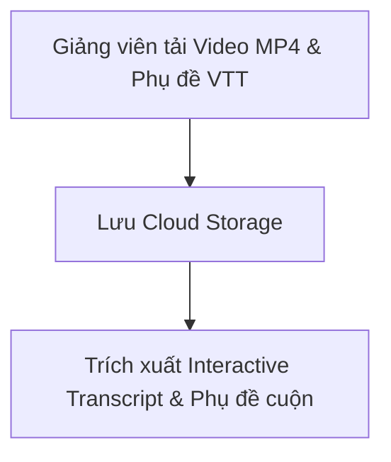

# 03. ĐẶC TẢ CHI TIẾT CÁC CHỨC NĂNG NGHIỆP VỤ (COURSERA-STYLE PLATFORM)

Tài liệu này đặc tả chi tiết và chuyên sâu các yêu cầu chức năng cho từng tác nhân (Super Admin, Giảng viên & Trợ giảng, Học viên) trên **Hệ thống Quản lý Học tập Chuẩn Coursera (Coursera-style LMS)**. Đây là cơ sở để thiết kế giao diện (UI/UX) và lập trình các luồng xử lý Backend/Frontend.

---

## 1. VAI TRÒ: SUPER ADMIN (QUẢN TRỊ NỀN TẢNG)

### 1.1. Quản lý tài khoản, Suất học Doanh nghiệp & Duyệt Hỗ trợ Tài chính
* **Thêm mới & Phân quyền:** Admin tạo tài khoản hoặc import danh sách hàng loạt (`.xlsx`, `.csv`). Phân quyền các vai trò: `Learner`, `Instructor`, `TA (Teaching Assistant)`, `Partner Admin`.
* **Mã hóa Mật khẩu, Declarative Auth Policy & Xác thực Token:**
  * Mật khẩu được mã hóa băm PBKDF2-HMAC-SHA256 (100k iterations + salt ngẫu nhiên), tự động tạo avatar SVG ngẫu nhiên từ DiceBear API và hỗ trợ quy trình Refresh Token rotation (`BR_AUTH_002`).
  * **Chính sách Phân quyền Declarative ở Tầng Contract (Protobuf Custom Options):** Toàn bộ các API ConnectRPC được gán nhãn chính sách bảo mật qua option `(auth.v1.policy)` trực tiếp trong hợp đồng `.proto`. `AuthPolicyRegistry` tự động quét descriptors khi khởi chạy server (Eager Pre-initialization) và phân lớp bảo mật 3 tầng (`BR_AUTH_001`): Tầng 1 (RPC Method Policy), Tầng 2 (ABAC Paid Access), Tầng 3 (Domain Resource Ownership).
* **Quản lý Suất học Doanh nghiệp (Enterprise License):**
  * Tạo gói suất học cho đối tác (ví dụ: cấp 500 seats cho Trường Đại học X hoặc Công ty Y).
  * Quản lý mã kích hoạt (Enterprise Key), kiểm tra trạng thái hoạt động (`is_active`) và theo dõi số lượng seat đã kích hoạt (`used_seats / total_seats`). Thao tác kích hoạt và thu hồi suất học bắt buộc thực hiện qua câu lệnh DB Atomic Update (`UPDATE enterprise_keys SET used_seats = used_seats + 1 ...`) để tránh Race Condition khi thao tác đồng thời (`BR_ACCESS_002`, `BR_ACCESS_003`). Hỗ trợ xử lý kích hoạt lặp lại an toàn (Idempotent) và áp dụng ràng buộc tối đa 1 mã Enterprise active per tài khoản.
* **Xét duyệt Hỗ trợ Tài chính (Financial Aid Review):** Super Admin duyệt hoặc từ chối các đơn xin học bổng (bài luận >= 150 từ). Nếu quá 15 ngày chưa có thao tác thủ công, hệ thống tự động chuyển trạng thái đơn sang `AUTO_APPROVED` (`BR_FAID_001`).
* **Khóa/Kích hoạt tài khoản:** Tạm khóa tài khoản vi phạm điều khoản. Thu hồi tức thì phiên làm việc (Session) của tài khoản bị khóa.

### 1.2. Giám sát hệ thống & API LLM (System & LLM Monitoring Dashboard)
* **Thống kê thời gian thực:** Số lượng người dùng trực tuyến (Active Learners), số lượng khóa học hiện hành, tổng dung lượng video/tài liệu.
* **Giám sát API LLM:** Thống kê số lượng Token tiêu thụ (Prompt Tokens, Completion Tokens), chi phí ước tính (USD), và tỷ lệ lỗi API theo ngày/tháng.
* **Báo cáo tài nguyên:** Tải CPU, RAM, lưu lượng mạng của hệ thống web server, Auto-Grader sandbox server và Vector Database.

### 1.3. Cấu hình kỹ thuật hệ thống (System Configurations)
* **Cấu hình API LLM:** Giao diện nhập và kiểm tra (Test Connection) API Key cho Gemini LLM. Cấu hình model mặc định (`gemini-1.5-flash`, `gemini-1.5-pro`).
* **Cài đặt tham số LLM:** Cấu hình `Temperature` (mặc định `0.2` để đảm bảo độ chính xác học thuật), `Max Output Tokens`, `Top-P`, `Top-K`.
* **Cấu hình Vector DB & Cloud Storage:** Địa chỉ kết nối Vector Database (Index Name, API Key) và Google Cloud Storage cho video/phụ đề.

### 1.4. Quản lý chất lượng & Báo cáo vi phạm (Quality Control & Abuse Management)
* **Giám sát chỉ số CSAT:** Tổng hợp điểm số hài lòng trung bình (1-5 sao) và tỷ lệ hoàn thành (Completion Rate) của từng khóa học.
* **Quản lý Báo cáo vi phạm (Abuse Queue):**
  * Tiếng nhận các báo cáo từ học viên về nội dung bài giảng bị lỗi/phản cảm hoặc gian lận điểm số.
  * *Hành động:* Gửi email nhắc nhở Giảng viên, ẩn tạm thời bài học (chuyển về trạng thái Nháp) hoặc thu hồi chứng chỉ vi phạm.

### 1.5. Quản lý B2B Đối tác Phát hành (Partner Organization Management)
* **Khởi tạo & Cấu hình B2B Partner:** Super Admin khởi tạo hồ sơ Đối tác (`CreatePartner`), cấu hình Tên miền được ủy quyền (`allowed_domains`), Logo, Banner và thông tin chữ ký mặc định.
* **RPC Services (`PartnerService`):** Đã mở đầy đủ 6 API RPC: `CreatePartner`, `UpdatePartner`, `GetPartner`, `ListPartners`, `DeletePartner`, `RotatePartnerKeyPair`.
* **Phân quyền Self-Service cho Partner Admin:** Cho phép tài khoản `PARTNER_ADMIN` tự chỉnh sửa hồ sơ thương hiệu, ảnh chữ ký đại diện, người ký và public key của chính tổ chức mình qua `UpdatePartner`, cũng như chủ động gọi `RotatePartnerKeyPair` để sinh cặp khóa ECDSA P-256 mới và nhận về duy nhất `public_key_pem` (`BR_PARTNER_001`, `BR_PARTNER_002`).

* **Xuất File Xác thực Tĩnh Tên miền (`openbadges-issuer.json`):** Hệ thống tự động sinh và cung cấp nút bấm tải file JSON tĩnh chuẩn OpenBadges 2.0 (`/partner/settings`) để Đối tác upload lên thư mục công khai `https://<domain>/.well-known/openbadges-issuer.json`, minh chứng quyền ủy quyền ký số mà không cần lập trình máy chủ (`BR_PARTNER_002`).

---

## 2. VAI TRÒ: GIẢNG VIÊN & TRỢ GIẢNG (INSTRUCTOR / TA)

### 2.1. Quản lý Cấu trúc Học tập Coursera & Hồ sơ Chữ ký (Specialization, Course & Instructor Profile)
* **Quản lý Hồ sơ & Chữ ký tay Điện tử (Instructor Profile & Signature V2):** Giảng viên chủ động cập nhật Chức danh khoa học (`title` - VD: *Professor of Computer Science, Stanford University*) và tải lên ảnh Chữ ký tay điện tử (`signature_image_url`) thông qua RPC `UpdateInstructorProfile`. Chữ ký này sẽ được nhúng tự động lên các chứng chỉ Verified Certificate do giảng viên đó phụ trách (`BR_CERT_002`).
* **Tạo Specialization (Chuỗi Chuyên ngành):** Nhóm nhiều khóa học liên quan theo một lộ trình nghề nghiệp (ví dụ: Chuyên ngành *Lập trình Python Nâng cao & AI* bao gồm 4 khóa học thành phần).
* **Cấu trúc Khóa học & Quản lý Vòng đời (Course Hierarchy & Lifecycle):**
  * **Tạo & Cập nhật Khóa học:** Giảng viên tạo mới (`CreateCourse`) hoặc cập nhật (`UpdateCourse`) Tên khóa học, Mô tả, Slug, Logo và Giảng viên phụ trách.
  * **Xóa Khóa học (`DeleteCourse`):** Giảng viên/Admin có quyền xóa hoàn toàn khóa học và toàn bộ bài giảng phụ thuộc khỏi hệ thống khi khóa học bị hủy bỏ.
  * Khóa học (Course) -> Tuần học (Module / Week) -> Bài học (Lesson) -> Các dạng bài học thành phần (Learning Items).
* **Quản lý Đơn vị Phát hành (Partner Branding):** Chọn đối tác phát hành (Partner Logo), hiển thị tên Giảng viên chính và danh sách Trợ giảng (TA).

### 2.2. Quy trình Kiểm duyệt & Phê duyệt Phát hành Khóa học (Review to Submit & Launch Workflow)
* **Quy trình 4 Bước Phát hành Khóa học (`BR_CATALOG_003`):**
  1. **Pre-submit Self-Checklist (Giảng viên tự kiểm tra):** Khung công cụ Course Builder tự động quét kiểm tra 4 tiêu chí bắt buộc (Phụ đề VTT, Quiz Matrix không rỗng, Rubrics rõ ràng, có Giảng viên phụ trách).
  2. **Gửi Yêu cầu Phê duyệt (`Submit for Launch`):** Giảng viên bấm nút *"Submit for Launch"*. Khóa học chuyển sang trạng thái `PENDING_REVIEW` và chuyển sang chế độ Chỉ đọc (Read-only).
  3. **Màn hình Kiểm duyệt (Course Reviewer Portal):** Partner Admin hoặc Super Admin truy cập giao diện Reviewer Portal, trải nghiệm khóa học dưới chế độ Xem trước như Học viên (*Preview Mode*).
  4. **Quyết định Phê duyệt / Từ chối (`Approve / Reject`):**
     - *Phê duyệt (Approve):* Khóa học chuyển sang `PUBLISHED` và chính thức xuất hiện trên Trang Tìm kiếm Công khai toàn cầu (`/courses`).
     - *Từ chối (Reject):* Reviewer ghi lại nhận xét/Feedback chỉnh sửa. Khóa học chuyển về `DRAFT` để Giảng viên hoàn thiện và nộp lại.

### 2.3. Soạn thảo & Quản lý Học liệu đa dạng (Learning Items Builder & Management)

* **Chỉnh sửa & Xóa Cấu trúc Bài giảng (Kiểm tra Ownership ở Tầng Application Use Case):**
  * Tất cả các thao tác chỉnh sửa/xóa cấu trúc bài giảng được kiểm tra quyền sở hữu (`owner_id`, `co_instructor_ids`) trực tiếp bên trong Application Use Cases (`CatalogUseCase._verify_ownership`) thông qua `enforce_course_ownership`, đảm bảo an toàn tuyệt đối chống tấn công IDOR:
  * **Tuần/Module học:** Cập nhật thông tin (`UpdateWeekModule`), Xóa tuần học (`DeleteWeekModule`), hoặc Kéo thả sắp xếp thứ tự Tuần (`ReorderWeekModules`).
  * **Bài học (Lesson):** Cập nhật tên và thời lượng (`UpdateLesson`), Xóa bài học (`DeleteLesson`), hoặc Kéo thả sắp xếp thứ tự Bài (`ReorderLessons`).
  * **Vật liệu học tập (Learning Item):** Cập nhật nội dung/video/markdown (`UpdateLearningItem`), Xóa học liệu (`DeleteLearningItem`), hoặc Kéo thả sắp xếp thứ tự Học liệu (`ReorderLearningItems`).
* Giảng viên xây dựng bài học bằng cách thêm các loại Learning Items (`CreateLearningItem`):
1. **Video Item:**
   * Tải tệp Video (MP4) và tệp Phụ đề (VTT/SRT).
   * Hệ thống tự động trích xuất chuỗi văn bản tạo thành **Interactive Transcript** (cho phép bấm vào từng câu thoại để tua video đến giây tương ứng).
   * **In-Video Quiz:** Giảng viên chèn câu hỏi trắc nghiệm tại mốc thời gian cụ thể (ví dụ: tại 03:15). Khi video chạy đến mốc này sẽ tự động dừng để học viên trả lời trước khi tiếp tục.
2. **Reading Item:** Soạn thảo bài đọc nội dung Rich-text / Markdown, nhúng hình ảnh, code block và hiển thị thời gian đọc ước tính.
3. **Practice Quiz Item:** Bài tập trắc nghiệm ngắn không tính điểm, hiển thị giải thích chi tiết ngay sau mỗi câu trả lời để học viên tự ôn luyện.

### 2.3. Phân hệ Đánh giá & Chấm điểm (Assessments & Rubric Builder)
1. **Graded Quiz & Question Bank Builder:**
   * **Ngân hàng câu hỏi (Question Bank - `CreateQuestionBank`, `ListQuestionBanks`, `AddQuestionToBank`, `UpdateQuestion`, `DeleteQuestion`):** Quản lý tập trung các kho câu hỏi theo môn học và phân loại (`PRACTICE`, `MODULE_EXAM`, `FINAL_EXAM`). Hỗ trợ các dạng câu hỏi (`SINGLE_CHOICE`, `MULTIPLE_CHOICE`, `TRUE_FALSE`, `FILL_IN_BLANK`), độ khó (`EASY`, `MEDIUM`, `HARD`), nội dung Markdown và giải thích đáp án chi tiết.
   * **Cấu hình Ma trận đề thi (Quiz Matrix - `ConfigureQuizMatrix`, `GetQuizMatrix`):** Thiết lập cấu hình rút đề thi động cho từng bài thi (`item_id`), bao gồm số lượng câu hỏi rút ngẫu nhiên theo từng tầng độ khó (`easy_count`, `medium_count`, `hard_count`), thời gian giới hạn làm bài (`time_limit_minutes`), ngưỡng điểm đạt tùy chỉnh (`passing_threshold_percent`), và bật/tắt xáo trộn đáp án (`shuffle_options`) (`BR_QUIZ_002`).
   * **Phân quyền Quản lý:** Tất cả các thao tác tạo/sửa/xóa Ngân hàng câu hỏi và thiết lập Ma trận đề thi bắt buộc phải thông qua kiểm tra phân quyền Giảng viên (`INSTRUCTOR`), Trợ giảng (`TA`) hoặc Quản trị viên (`ADMIN`).
   * **Timed Quiz Server-side (`StartGradedQuizSession`):** Khởi tạo phiên thi đếm ngược đồng bộ từ Server (`BR_QUIZ_003`), tự động cấp `session_seed` để phục vụ lấy mẫu đề thi và chấm điểm chuẩn xác.
2. **Auto-Graded Lab Builder (Dành cho bài tập lập trình):**
   * Giảng viên tải lên bộ Test Cases và File mẫu (Starter Code).
   * Cấu hình môi trường chạy (Python, Node.js...) và giới hạn tài nguyên (Timeout, Memory Limit).
3. **Peer-Graded Assignment Builder:**
   * Giảng viên soạn đề bài nộp dự án (yêu cầu đính kèm file, văn bản hoặc link).
   * **Bộ tiêu chí Rubric:** Giảng viên chia các tiêu chí chấm điểm chi tiết (ví dụ: Tiêu chí 1: Cấu trúc code - Max 5 điểm; Tiêu chí 2: Giao diện - Max 5 điểm) kèm hướng dẫn chi tiết cho học viên chấm chéo.

### 2.4. Quản lý Khóa học & Diễn đàn (Course Ownership, Forum Moderation & Announcements)
* **Quyền sở hữu Khóa học (Course Ownership & Co-Instructors):** Mỗi khóa học gắn với một Chủ sở hữu chính (`owner_id`) và danh sách Giảng viên đồng phụ trách (`co_instructor_ids`). Giảng viên chỉ có quyền chỉnh sửa/xóa khóa học do mình sở hữu hoặc phụ trách.
* **Thông báo Khóa học (`CreateCourseAnnouncement`, `ListCourseAnnouncements`):** Giảng viên/Admin gửi thông báo truyền thông, lịch livestream hoặc nhắc nhở nộp bài tới toàn bộ học viên đăng ký khóa học.
* **Điều phối & Kiểm duyệt Diễn đàn (Forum Moderation, Editing & Pinning):** 
  * Trợ giảng/Giảng viên/Quản trị viên có quyền ghim câu trả lời chính thức (`is_staff_answer`). Khi được ghim, hệ thống tự động đánh dấu `is_staff_pinned = True` trên bài thảo luận gốc (Thread) để ưu tiên hiển thị đầu danh sách.
  * Tác giả bài viết (`author_user_id == current_user.id`) có quyền cập nhật (`UpdateThread`, `UpdateReply`) hoặc xóa bài đăng của mình. Khi tác giả chỉnh sửa bài viết/bình luận, hệ thống tự động đánh dấu `is_edited = True` và ghi nhận timestamp `edited_at` để người xem dễ dàng phân biệt bài viết đã qua chỉnh sửa.
  * Ban kiểm duyệt (`TA`, `INSTRUCTOR`, `ADMIN`) có quyền xóa bài viết/bình luận vi phạm quy chuẩn cộng đồng của bất kỳ người dùng nào.
* **Hỗ trợ Giải đáp:** Giảng viên/Trợ giảng trực tiếp theo dõi các bài đăng gắn với bài học (Item-level Discussion) để giải thích kiến thức nâng cao cho học viên.

### 2.5. Bảng Phân tích & Quản lý Lớp học (Instructor Analytics & Student Roster)
* **Báo cáo Thống kê Lớp học thời gian thực (`GetInstructorAnalytics`):** Giảng viên theo dõi tổng số học viên ghi danh (`total_enrolled_students`), tỷ lệ hoàn thành khóa học trung bình (`average_completion_rate`), điểm đánh giá sao trung bình (`average_rating`), và tổng số đánh giá.
* **Danh sách Học viên (Student Roster):** Xem chi tiết thông tin và phần trăm tiến độ hoàn thành bài học của từng học viên ghi danh trong lớp.
* **Phân tích Tỷ lệ Bỏ học (Student Drop-off Funnel):** Thống kê số lượng học viên dừng học tại từng bài học video/bài đọc để giúp Giảng viên nhận biết đoạn nội dung khó tiếp thu.

---

## 3. VAI TRÒ: HỌC VIÊN (LEARNER)

### 3.1. Trình phát Bài học Coursera (Course Player & Notes)
* **Giao diện Trình phát Bài học:**
  * Cột bên trái hiển thị danh sách Tuần học (Week) và danh sách Items.
  * Khung giữa phát Video / Bài đọc / Quiz.
* **Tính năng Interactive Transcript & Highlight Notes:**
  * Phụ đề cuộn tự động theo lời nói trong video. Bấm vào dòng phụ đề để nhảy đến giây video tương ứng.
  * Học viên có thể bôi đen (Highlight) từ/cụm từ trong phụ đề hoặc bài đọc để lưu lại thành **Ghi chú cá nhân (Personal Notes)**.
* **In-Video Quiz Experience:** Video tự dừng tại mốc thời gian chèn quiz. Học viên chọn đáp án và bấm "Submit" để xem giải thích và tiếp tục xem video.

### 3.2. Cơ chế Học tập Linh hoạt & Reset Deadlines (Flexible Weekly Schedule)
* **Hạn nộp linh hoạt (Flexible Deadlines):** Mỗi tuần học có hạn nộp gợi ý (Suggested Deadlines) để học viên duy trì tiến độ.
* **Tính năng "Reset My Deadlines":** Nếu học viên bận việc và quá hạn nộp bài (Overdue), màn hình khóa học sẽ xuất hiện nút **"Reset my deadlines"**. Khi bấm nút này, hệ thống sẽ tự động cập nhật lịch nộp bài sang đợt mới mà không trừ điểm thi. Đối với khóa Self-paced, hệ thống tự động gia hạn `Course_End_Date` tính từ mốc reset để phân bổ hạn nộp các tuần hợp lý mà không bị dồn cục (`BR_DEADLINE_001`).

### 3.4. Diễn đàn Thảo luận theo Bài học (Discussion Forum)
* **Thảo luận gắn với Item (Item-level Discussion):** Dưới mỗi bài học video/bài đọc có mục "Discussion". Học viên gửi câu hỏi và nhận câu trả lời từ bạn học trên khắp thế giới.
* **Chỉnh sửa & Chỉ báo Chỉnh sửa (`is_edited`):** Học viên có thể cập nhật bài hỏi hoặc câu trả lời của chính mình. Nội dung sau khi chỉnh sửa sẽ hiển thị nhãn chỉ báo "Đã chỉnh sửa" (`is_edited = True`) kèm mốc thời gian `edited_at`.
* **Upvote & Staff Pinning:** Học viên có thể Upvote câu trả lời hữu ích. Các câu trả lời được Trợ giảng ghim (Staff Answer) sẽ được làm nổi bật với huy hiệu đặc biệt.

### 3.5. Phân hệ Đánh giá Năng lực (Assessments Sub-system)
* **Cam kết Liêm chính Học thuật (Academic Honor Code):** Bắt buộc tích chọn xác nhận trước khi làm bài. Nếu từ chối (`is_agreed = False`), hệ thống chặn nộp bài và trả về thông báo lỗi kèm điểm số 0.
* **Graded Quiz:** Ngân hàng câu hỏi xáo trộn (`BR_QUIZ_002`), đồng đồng đếm ngược Server-side (`BR_QUIZ_003`), tự động chấm điểm và áp dụng nguyên tắc *Highest Score Wins* (giữ điểm thi cao nhất). Học viên trượt 3 lần phải chờ hết 8h Cooldown; học viên đã đạt điểm Pass (>= 80%) có thể thi lại cải thiện điểm mà không bị áp dụng Cooldown (`BR_QUIZ_001`).
* **Auto-Graded Lab:** Học viên tải file code lên -> Sandbox gửi tới Auto-Grader chạy Test Cases -> Trả về danh sách Pass/Fail test cases, log stdout/stderr và điểm số tức thì.
* **Peer-Graded Assignment Sub-system:**
  1. **Nộp bài:** Học viên nộp bài dự án trước deadline.
  2. **Chấm chéo:** Hệ thống phân bổ các bài làm của bạn học ngẫu nhiên (tự động loại trừ bài của chính mình `exclude_user_id`), số lượt bắt buộc tự động điều chỉnh theo $\min(3, \text{Pool\_Size})$ đối với lớp học mới (`BR_PEER_001`, `BR_PEER_006`). Học viên chấm theo bộ 3 tiêu chí Rubric (Code Quality, Documentation, Test Coverage - mỗi tiêu chí max 10đ).
  3. **Tính điểm & Outlier:** Điểm chính thức = Tổng điểm đạt / Tổng điểm tối đa * 100%. Nếu chênh lệch $Max(Scores) - Min(Scores) > 30.0\%$, hệ thống tự động gắn cờ Outlier (`is_outlier = True`) và gửi cảnh báo đến Trợ giảng (TA).
  4. **Fallback khi thiếu bài chấm chéo & Report:** Nếu sau 48h chưa đủ bài phân bổ hoặc bị học viên bấm Report Review, bài làm sẽ ở trạng thái `PENDING_STAFF_REVIEW` và chuyển vào Staff Regrade Queue cho TA chấm/xác minh trực tiếp để chống gian lận (`BR_PEER_004`, `BR_PEER_005`).
  5. **Khiếu nại điểm (Grade Appeal):** Học viên gửi đơn khiếu nại với lý do chi tiết (trạng thái `"PENDING"`) để Trợ giảng (TA) chấm lại thủ công.

### 3.6. Chứng nhận & Xác thực Thành tích (Verified Certificate & OpenBadges)
* **Quy trình Xác minh Danh tính (Identity Verification):** Trước khi phát hành chứng chỉ Verified Certificate lần đầu tiên, học viên thực hiện bước xác minh danh tính bằng cách tải ảnh CCCD/Hộ chiếu và chụp ảnh sinh trắc học khuôn mặt qua Webcam (`BR_CERT_003`).
* **Cấp Chứng chỉ Xác minh (Verified Certificate):** Khi hoàn thành 100% bài học và đạt điểm Pass ở tất cả bài Graded items (>= 80%), hệ thống tự động phát hành Verified Certificate và lưu cố định dữ liệu **Immutable Data Snapshot** (Tên học viên, Tên khóa học) tại mốc cấp (`BR_CERT_002`, `BR_CERT_003`).
* **Mã xác minh công khai & Sinh QR Code In-Memory:** Mỗi chứng chỉ có đường dẫn công khai độc nhất (`/verify/CERT-XXXXXXXXXX`) và mã QR code được sinh tự động trực tiếp dạng SVG/Data URI in-memory (0 bytes storage) để nhà tuyển dụng kiểm tra tính hợp lệ mà không phụ thuộc dịch vụ bên thứ ba.
* **OpenBadges & LinkedIn Sharing:** Chứng chỉ được nhúng siêu dữ liệu JSON-LD chuẩn OpenBadges 2.0 đầy đủ thông tin `BadgeClass`, `issuer`, `criteria`. Học viên chỉ cần 1 cú nhấp chuột để chia sẻ trực tiếp thành tích lên hồ sơ LinkedIn.
### 3.7. Đánh giá Khóa học & Trải nghiệm Hoàn thành (Course Rating, Review & Completion Modal)
* **Popup Chúc mừng Hoàn thành Khóa học (Course Completion Modal):** Khi tiến độ bài học đạt 100% và đạt đủ điều kiện Pass các bài kiểm tra, trình phát bài học `/learn/[courseId]` lập tức kích hoạt hiệu ứng pháo hoa và hiển thị Modal chúc mừng.
* **Nhận chứng chỉ trực tiếp (Direct Certificate Claim):** Nút *"Nhận chứng chỉ xác minh (Claim Certificate)"* trên Modal điều hướng trực tiếp học viên tới cổng xác thực công khai `/verify/[certId]`.
* **Đánh giá & Nhận xét Khóa học (Course Rating & Review):**
  * Học viên đạt tối thiểu 50% tiến độ bài học chọn điểm đánh giá từ 1 đến 5 sao (⭐) và nhập lời bình luận chi tiết (`BR_REVIEW_001`).
  * RPC `SubmitCourseReview` gửi thông tin đánh giá về Backend lưu trữ, phân loại cờ `is_verified_completer` và cập nhật trực tiếp cache CSAT trên `CourseModel` (`BR_REVIEW_002`).
  * Trang thông tin khóa học `/courses/[courseId]` tự động tổng hợp và hiển thị điểm sao trung bình (ví dụ: `4.8 ★ (1,250 lượt đánh giá)`) cùng danh sách các nhận xét của học viên khác kèm badge phân loại (`Verified Completer` vs `Active Learner Review`).

---

## 4. VAI TRÒ: ĐỐI TÁC PHÁT HÀNH (PARTNER / ORGANIZATION ADMIN)

### 4.1. Quản lý Thương hiệu & Logo Tổ chức (Partner Branding & Identity)
* **Cấu hình Hồ sơ Đối tác:** Cập nhật Tên đối tác (ví dụ: Stanford University, DeepLearning.AI), biểu tượng Logo chính thức (Partner Logo URL) và chữ ký xác thực đại diện.
* **Đồng thương hiệu:** Hiển thị thương hiệu đối tác trên toàn bộ giao diện khóa học phát hành và nhúng thông tin đối tác vào Chứng chỉ xác minh (Verified Certificate).

### 4.2. Quản lý Gói Suất học & Báo cáo Tổ chức (Enterprise Seats & Organization Dashboard)
* **Kích hoạt Suất học:** Quản lý danh sách mã Suất học Doanh nghiệp (Enterprise Keys), theo dõi hạn mức (`used_seats / total_seats`).
* **Báo cáo Hoàn thành:** Xem thống kê tỷ lệ hoàn thành chương trình học và danh sách học viên thuộc tổ chức nhận Verified Certificate.
