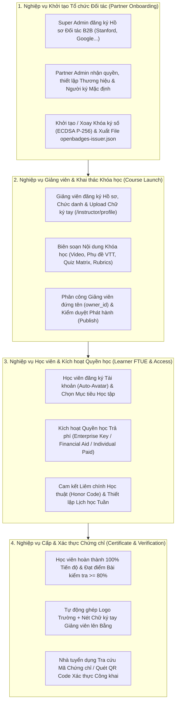

# 06. BUSINESS INITIALIZATION & ONBOARDING OPERATIONS BLUEPRINT

Tài liệu này quy định **Toàn bộ Quy trình Vận hành Nghiệp vụ (Pure Business Workflows Blueprint)** của hệ thống **Coursera-style LMS**, hướng dẫn chi tiết cách các Tác nhân Nghiệp vụ (Super Admin, Partner Admin, Giảng viên, Học viên, Nhà tuyển dụng) phối hợp đưa hệ thống từ khi khởi tạo tổ chức đối tác đến khi phát hành chứng chỉ xác minh.

---

## 1. Sơ đồ Chuỗi Nghiệp vụ Vận hành (Business Operations Flow)

---

## 2. NGHIỆP VỤ 1: Đăng ký & Cấu hình Tổ chức Đối tác (B2B Partner Onboarding)

Giai đoạn này thiết lập tư cách pháp lý và đại diện thương hiệu cho các Trường Đại học hoặc Tập đoàn hợp tác phát hành khóa học.

### 📋 Bảng Chi tiết Quy trình Nghiệp vụ Partner Onboarding:

| Bước | Vai trò Nghiệp vụ (Actor) | Thao tác Nghiệp vụ | Dữ liệu Đầu vào (Business Input) | Kết quả Nghiệp vụ (Business Outcome) |
| :---: | :--- | :--- | :--- | :--- |
| **1.1** | Super Admin | Khởi tạo Hồ sơ Đối tác B2B | Tên trường (*Stanford Online*), Slug (`stanford-online`), Tên miền ủy quyền (`["@stanford.edu"]`). | Tổ chức Đối tác được ghi nhận chính thức trên Nền tảng. |
| **1.2** | Super Admin | Bổ nhiệm Quản trị viên Đối tác | Cấp tài khoản `partner@stanford.edu` với vai trò `PARTNER_ADMIN`. | Người đại diện Trường có toàn quyền tự quản lý hồ sơ đối tác. |
| **1.3** | Partner Admin | Thiết lập Nhận diện Thương hiệu | Tải lên Logo chính thức, Banner bìa, Họ tên & Chức danh Hiệu trưởng / Viện trưởng. | Hoàn thiện Trang giới thiệu đối tác công khai (`/partners/stanford-online`). |
| **1.4** | Partner Admin | Khởi tạo / Xoay Khóa Ký số | Chọn *"🔄 Tạo Cặp Khóa Ký số Mới"* trên Admin Portal. | Hệ thống cấp Cặp khóa ECDSA P-256 mới. Khóa cũ tự động lưu vết vào danh sách lịch sử. |
| **1.5** | Partner Admin | Ủy quyền Xác thực Tên miền | Bấm *"📥 Tải xuống File openbadges-issuer.json"* dán lên `https://stanford.edu/.well-known/openbadges-issuer.json`. | Minh chứng kỹ thuật công khai việc Trường ủy quyền ký số cho Nền tảng mà không cần máy chủ riêng. |

---

## 3. NGHIỆP VỤ 2: Hồ sơ Giảng viên, Biên soạn & Phát hành Khóa học (Course Launch)

Giai đoạn này đảm bảo chất lượng chuyên môn bài giảng và sự bảo chứng trực tiếp từ đội ngũ Giáo sư / Giảng viên đứng lớp.

### 📋 Bảng Chi tiết Quy trình Nghiệp vụ Course Launch:

| Bước | Vai trò Nghiệp vụ (Actor) | Thao tác Nghiệp vụ | Dữ liệu Đầu vào (Business Input) | Kết quả Nghiệp vụ (Business Outcome) |
| :---: | :--- | :--- | :--- | :--- |
| **2.1a** | Học viên (Learner) | Nộp Đơn đăng ký Giảng viên cá nhân | Đăng nhập `/become-an-instructor`, điền Chức danh, Bio, Link LinkedIn, File CV (.pdf) & Link Video giảng demo. | Đơn xin cấp quyền được khởi tạo ở trạng thái `PENDING_REVIEW`. |
| **2.1b** | Super Admin | Kiểm duyệt & Thẩm định Hồ sơ | Xem xét năng lực trên Admin Portal (`/admin/applications`) và chọn Phê duyệt (**Approve**). | Tài khoản chuyển vai trò `USER_ROLE_INSTRUCTOR`, hệ thống tự động gán vào Partner Mặc định **`Coursera Project Network`** (`partner_id = "partner_community"`). |
| **2.1c** | Giảng viên | Cấu hình Hồ sơ & Chữ ký tay | Đăng nhập `/instructor/profile`, điền Chức danh khoa học (*GS. Andrew Ng - Senior AI Expert*) & Upload nét ký tay PNG. | Mẫu chữ ký tay điện tử sẵn sàng để nhúng lên chứng chỉ sau này (`BR_CERT_002`). |
| **2.2** | Giảng viên | Xây dựng Cấu trúc Học tập | Tạo Tuần học (Week 1, Week 2), đăng Video kèm Phụ đề VTT, soạn Bài đọc và Ma trận Quiz. | Khung chương trình bài giảng hoàn thiện dưới dạng Bản nháp (Draft). |
| **2.3** | Giảng viên | Cấu hình Rubric & Peer Review | Nhập tiêu chí chấm điểm tự luận/dự án (Rubric Criteria) và số lượng bài chấm bắt buộc ($N=3$). | Bộ bài tập thực hành & chấm chéo sẵn sàng vận hành. |
| **2.4** | Partner Admin | Phân công Giảng viên phụ trách | Gán Giảng viên chính (`owner_id`) và Giảng viên đồng giảng dạy (`co_instructor_ids`). | Xác định tư cách Giảng viên đứng tên đại diện trên Chứng chỉ (`BR_CATALOG_001`). |
| **2.5** | Giảng viên | Gửi Yêu cầu Phê duyệt (`Submit for Launch`) | Bấm nút *"Submit for Launch"* (Pre-submit checklist PASS). | Khóa học chuyển sang trạng thái **`PENDING_REVIEW`** và tạm khóa quyền chỉnh sửa (Read-only `BR_CATALOG_003`). |
| **2.6** | Partner Admin / Reviewer | Màn hình Kiểm duyệt (*Course Reviewer Portal*) | Xem trước dưới chế độ Học viên (*Student Preview Mode*). | Đánh giá chất lượng thực tế video, phụ đề VTT, bài thi thi thử và bài tập dự án. |
| **2.7** | Partner Admin / Reviewer | Phê duyệt hoặc Từ chối (*Approve / Reject*) | Bấm *"Approve & Publish"* hoặc *"Reject"* kèm Feedback lý do. | Nếu Approve: Khóa học chuyển sang **`PUBLISHED`** mở bán công khai. Nếu Reject: Khóa học về **`DRAFT`** kèm góp ý để Giảng viên sửa lại. |

---

## 4. NGHIỆP VỤ 3: Học viên Đăng ký, Kích hoạt Quyền học & Làm bài (Learner Access & FTUE)

Giai đoạn trải nghiệm của Học viên từ khi mở tài khoản đến khi học tập và tuân thủ các quy chế học thuật.

### 📋 Bảng Chi tiết Quy trình Nghiệp vụ Learner Access:

| Bước | Vai trò Nghiệp vụ (Actor) | Thao tác Nghiệp vụ | Dữ liệu Đầu vào (Business Input) | Kết quả Nghiệp vụ (Business Outcome) |
| :---: | :--- | :--- | :--- | :--- |
| **3.1** | Học viên | Đăng ký Tài khoản mới | Đăng ký qua Email/Mật khẩu hoặc Single Sign-On (SSO). | Khởi tạo tài khoản, tự động kích hoạt Ảnh đại diện cá nhân hóa DiceBear (`BR_AUTH_003`). |
| **3.2** | Học viên | Đăng ký Chế độ Học tập | Chọn Audit Mode (Miễn phí) hoặc Nâng cấp Paid Mode (Qua Thẻ cá nhân, Mã Enterprise Key, hoặc Đơn Financial Aid). | Mở khóa toàn bộ Bài kiểm tra tính điểm, Bài tập thực hành và Quyền nhận Chứng chỉ. |
| **3.3** | Học viên / Admin | Quản lý Suất học Enterprise | Nhập mã Enterprise Key tài trợ từ Doanh nghiệp/Trường học. | Tự động hưởng quyền Paid Mode mà không tốn chi phí. Cho phép thu hồi & tái cấp suất học nếu trễ học (`BR_ACCESS_003`). |
| **3.4** | Học viên | Cam kết Honor Code | Tích chọn cam kết *"Academic Honor Code"* trước bài thi đầu tiên. | Ghi nhận cam kết liêm chính học thuật (`BR_HONOR_001`). |
| **3.5** | Học viên | Học tập & Đặt lại Hạn nộp | Học bài theo đợt học tuần. Nếu bận, bấm *"Reset my deadlines"*. | Chuyển lịch học sang đợt tiếp theo mà không bị trừ điểm thi hay phạt tiến độ. |

---

## 5. NGHIỆP VỤ 4: Phát hành Chứng chỉ Verified Certificate & Xác thực Công khai (Certificate Verification)

Giai đoạn tự động hóa quy trình đánh giá kết quả và phát hành bằng cấp số chuẩn quốc tế.

### 📋 Bảng Chi tiết Quy trình Nghiệp vụ Certificate & Verification:

| Bước | Vai trò Nghiệp vụ (Actor) | Thao tác Nghiệp vụ | Dữ liệu Đầu vào (Business Input) | Kết quả Nghiệp vụ (Business Outcome) |
| :---: | :--- | :--- | :--- | :--- |
| **4.1** | Học viên | Hoàn thành Khóa học | Đạt 100% Tiến độ xem bài & Đạt điểm tất cả Bài kiểm tra Graded Items >= 80%. | Tự động kích hoạt Động cơ Cấp chứng chỉ (`BR_CERT_001`). |
| **4.2** | Hệ thống LMS | Tự động Cấp Chứng chỉ | Khóa thông tin cố định (Immutable Snapshot) Tên học viên, Tên khóa học, Logo trường, Chữ ký tay Giảng viên. | Ghi nhận bản ghi `VerifiedCertificate` công khai và sinh mã Hash độc nhất (VD: `CERT-DEMO12345`). |
| **4.3** | Học viên | Xem & Chia sẻ Bằng cấp | Truy cập Danh sách Chứng chỉ (`/certificates`) hoặc Trang Xác thực (`/verify/[certId]`). | Xem tờ Chứng chỉ trang trọng có hiển thị Logo Trường, Khối Chữ ký tay Giảng viên & Mã QR Code. |
| **4.4** | Nhà tuyển dụng | Tra cứu & Xác minh Kỹ thuật | Nhập Mã chứng chỉ hoặc Quét mã QR bằng Camera điện thoại. | Kiểm tra tính chính xác của bằng cấp, đối chiếu chữ ký số ECDSA P-256 và dữ liệu OpenBadges JSON-LD. |

---
*Tài liệu tập trung 100% vào Quy trình Nghiệp vụ Vận hành, đồng bộ với Quy tắc Nghiệp vụ (`docs/04_business_rules.md`) và Tiêu chuẩn OpenBadges 2.0/3.0.*
