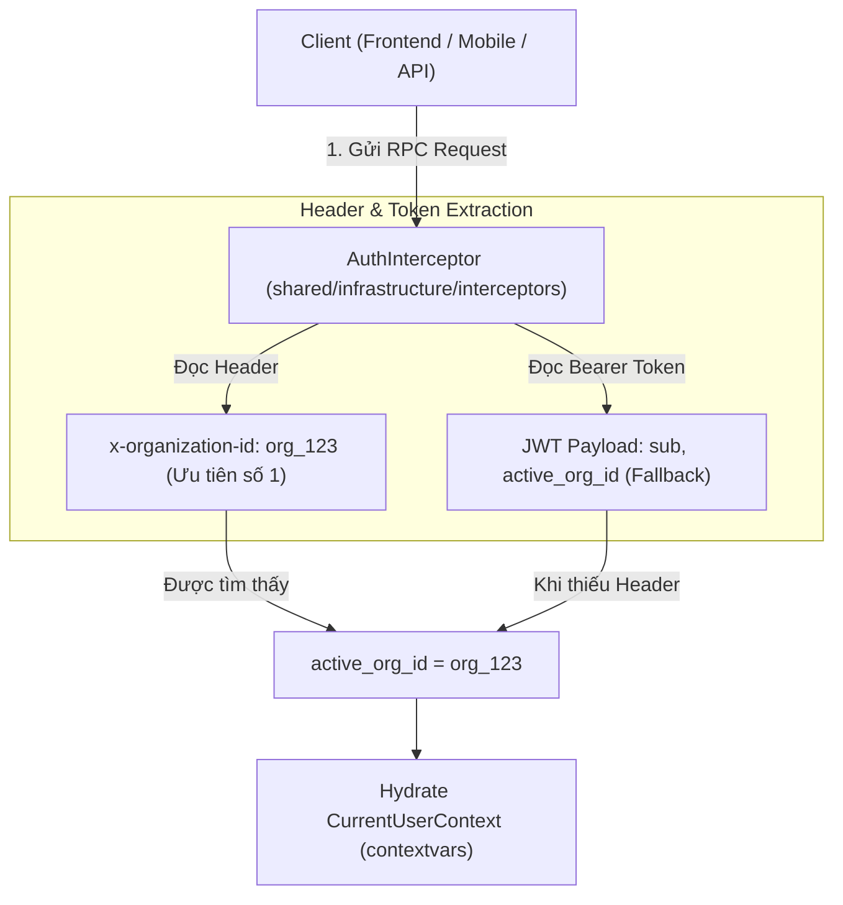

# 07. Kiến Trúc Xác Thực (AuthN) & Phân Quyền Hỗ Trợ Đa Tổ Chức (AuthZ & Multi-Org)

Tài liệu này mô tả chi tiết kiến trúc kỹ thuật Xác thực (Authentication), Phân quyền (Authorization), và cơ chế quản lý Ngữ cảnh Tổ chức (Organization Context) trong hệ thống.

---

## 1. Tổng quan Kiến trúc

Hệ thống áp dụng mô hình **Hybrid PBAC (Permission-Based Access Control) kết hợp SQL Scope Pushdown** hỗ trợ Multi-Tenancy / Multi-Organization:

* **Tách biệt Xác thực & Phân quyền**:
  * **AuthN**: Đăng nhập, verify JWT Access Token, trích xuất `user_id` và `system_role`.
  * **AuthZ**: Kiểm tra quyền truy cập tài nguyên dựa trên ngữ cảnh Tổ chức (`active_org_id`) và tập hợp Quyền hạn (`permissions`).
* **Mô hình BFF (Backend For Frontend) & Bảo mật HttpOnly Cookie**:
  * **Browser ➔ Backend (ConnectRPC)**: Browser tự động gửi `HttpOnly` cookie (`access_token`) bằng `credentials: "include"`. Tuyệt đối không lưu token trong JavaScript, `localStorage` hay `document.cookie` (chống lỗ hổng XSS).
  * **Next.js Server ➔ Backend (SSR)**: Trích xuất `access_token` từ Cookie context và chuyển đổi thành header `Authorization: Bearer <token>` khi thực hiện lệnh gọi ConnectRPC từ server (Server Components).
  * **Server Actions (BFF Gateway)**: Quản lý đăng nhập (`loginAction`), làm mới token (`refreshSessionAction`) và đăng xuất (`logoutAction`), thiết lập cookie `HttpOnly; Secure; SameSite=Lax`.
* **Backend Token Resolver Chain (Strategy Pattern)**:
  * Backend hỗ trợ trích xuất JWT thông qua chuỗi chiến lược `TokenResolverChain` (`backend/src/shared/infrastructure/auth/token_resolvers.py`): ưu tiên `BearerTokenResolver` (SSR/Mobile/Third-party) và `CookieTokenResolver` (Browser Direct).
* **Không phụ thuộc thư viện phân quyền bên ngoài**: Triển khai 100% bằng thư viện chuẩn Python (`contextvars`, `dataclasses`) và tính năng có sẵn của `SQLAlchemy 2.0`.

---

## 2. Cơ Chế Truyền Ngữ Cảnh Tổ Chức (Organization Context & JWT Request Header)

### A. Vấn đề Multi-Tab trên Trình duyệt Web
Khi người dùng thuộc nhiều Tổ chức (ví dụ: vừa thuộc *Đại học Bách Khoa*, vừa thuộc *Coursera Project Network*):
* Nếu lưu cố định `active_org_id` duy nhất trong JWT Access Token (có thời hạn 60 phút), khi người dùng chuyển đổi Tổ chức ở Tab 2, Token mới sẽ làm cho Tab 1 bị lẫn lộn dữ liệu giữa 2 tổ chức (Lỗi *State Leakage / Race Condition* giữa các tab).

### B. Giải pháp Best Practice: Header-based Context với JWT Fallback
Hệ thống sử dụng cơ chế đính kèm Header kết hợp JWT Claim:



#### Quy tắc trích xuất Ngữ cảnh:
1. **Primary Source (Nguồn chính)**: Header `x-organization-id` (hoặc `X-Organization-Id`, `x-org-id`) trong Metadata của ConnectRPC request. Mỗi tab trình duyệt tự quản lý `organization_id` riêng trong State.
2. **Fallback Source (Nguồn dự phòng)**: Claim `active_org_id` trong JWT Access Token (dành cho API Client bên thứ 3 hoặc Mobile Client không gửi Header).
3. **Internal Default (Mặc định toàn sàn)**: Nếu không có cả Header lẫn Claim trong Token, `active_org_id` mặc định là `None` (hoặc `partner_community` đối với các thao tác khóa học công khai).

---

## 3. Cấu trúc Đối tượng Security Context (`CurrentUserContext`) & Các Vai trò trong Tổ chức

Toàn bộ thông tin xác thực và phân quyền của User được lưu trong `CurrentUserContext` (`backend/src/shared/auth.py`) thông qua `contextvars` per-request:

```python
@dataclass
class CurrentUserContext:
    id: str                                  # User ID (sub)
    email: str = ""                          # User Email
    role: str = ""                           # Legacy Role string (dùng cho tương thích ngược)
    system_role: str = "USER"                # SUPER_ADMIN | USER
    active_org_id: Optional[str] = None      # Organization ID hiện tại từ Header/Token
    org_role: Optional[str] = None           # Role trong Organization hiện tại
    permissions: set[str] = field(default_factory=set)  # Tập hợp Permission trong Org hiện tại
```

---

## 3.1. Danh mục Vai trò trong 1 Tổ chức (Organization Roles)

Mỗi Tổ chức (`Organization`) trong hệ thống duy trì 3 vai trò chính ở tầng Tổ chức (`organization_roles`):

1. **Organization Admin (Quản trị viên Tổ chức)**:
   * Quản lý thành viên, mời/xóa và phân quyền cho người dùng trong Tổ chức.
   * Quản lý kho bản quyền, phân bổ và thu hồi Suất học Enterprise Seat (`enterprise_seat_key`).
   * Quản lý danh mục khóa học, thông tin thương hiệu và chữ ký bảo chứng đại diện cho Tổ chức.
2. **Organization Instructor (Giảng viên Tổ chức)**:
   * Soạn thảo, quản lý cấu trúc học liệu, ma trận đề thi và xuất bản khóa học thuộc phạm vi Tổ chức.
   * Xem báo cáo thống kê tiến độ, bảng điểm toàn bộ học viên thuộc các khóa học phụ trách.
3. **Teaching Assistant - TA (Trợ giảng Tổ chức)**:
   * Hỗ trợ Giảng viên rà soát bài nộp, chấm bài tự luận / phúc khảo bài tập Peer Review (`TA Regrade Override`).
   * Quản lý và giải đáp thắc mắc trên Diễn đàn thảo luận (Discussion Forum), gán cờ câu trả lời chính thức (`is_staff_answer`).

---

## 3.2. Phân biệt Thành viên Tổ chức (Member) vs Người được cấp Suất học (Enterprise Seat Holder)

| Tiêu chí | Thành viên Tổ chức (Organization Member) | Người được cấp Suất học (Enterprise Seat Holder) |
| :--- | :--- | :--- |
| **Bản chất** | **Hành chính / Phân quyền (AuthZ)**: Định nghĩa vị trí công tác và quyền quản lý/giảng dạy của người dùng trong Tổ chức (`organization_members`). | **Tài chính / Quyền lợi Học tập (License)**: Định nghĩa trạng thái tài trợ bản quyền học tập trả phí (`enterprise_seat_key`). |
| **Vai trò tương ứng** | `Organization Admin`, `Organization Instructor`, `Teaching Assistant` hoặc `Member`. | Thường là `Learner` (Học viên / Sinh viên / Nhân viên). |
| **Quyền lợi học tập** | Có quyền quản trị, biên soạn bài giảng hoặc trợ giảng tùy theo `org_role`. | Được nâng cấp từ **Audit Mode (Miễn phí)** lên **Paid Mode (Trả phí)**: Được làm bài thi tính điểm Graded Quiz, nộp Lab, được chấm bài Peer Review và nhận Verified Certificate mà không cần tự bỏ tiền mua khóa học. |
| **Cơ chế hoạt động** | Xác định qua bộ quyền `permissions` trong `CurrentUserContext` khi đứng ở `active_org_id`. | Xác định qua mã `user.enterprise_seat_key` và phạm vi khóa học được phép (`scope_type`: `ALL_COURSES` hoặc `CURATED_COURSES`). |

---

## 3.3. Các Phương thức Kiểm tra Quyền Hạn:
* `is_system_admin() -> bool`: Trả về `True` nếu user là Quản trị viên Toàn hệ thống (`SUPER_ADMIN`). Super Admin tự động có mọi quyền.
* `has_permission(permission: str) -> bool`: Kiểm tra user me có sở hữu permission cụ thể (e.g. `course:create`, `course:publish`) hay không.
* `require_permission(permission: str) -> None`: Kiểm tra quyền, nếu không có sẽ ném lỗi `ConnectError(Code.PERMISSION_DENIED)`.
* `require_org_context() -> str`: Trả về `active_org_id`, nếu thiếu sẽ ném lỗi `ConnectError(Code.FAILED_PRECONDITION)`.


---

## 4. SQL Scope Pushdown (Phân quyền Tầng Database)

Đối với các API lấy Danh sách / Lọc / Tìm kiếm (ví dụ: `ListCourses`), hệ thống **không bao giờ** kéo dữ liệu về RAM để lọc.

Hàm `apply_organization_scope()` (`backend/src/shared/infrastructure/scopes.py`) tự động đẩy điều kiện lọc xuống câu SQL:

```python
def apply_organization_scope(stmt: Select, model_cls: Any, ctx: Optional[CurrentUserContext]) -> Select:
    if not ctx or ctx.is_system_admin():
        return stmt

    if ctx.active_org_id:
        return stmt.where(
            or_(
                model_cls.organization_id == ctx.active_org_id,
                model_cls.organization_id == INTERNAL_SYSTEM_ORG_ID,  # "partner_community"
            )
        )

    return stmt.where(model_cls.organization_id == INTERNAL_SYSTEM_ORG_ID)
```

✅ **Kết quả**:
* PostgreSQL thực thi câu lệnh SQL với chỉ mục Index `ix_courses_organization_id`.
* Đảm bảo tính chính xác 100% cho phân trang `LIMIT` / `OFFSET`.

---

## 5. Quy tắc Giảng viên Cá nhân & Organization Mặc định

* **Ràng buộc Khóa học 100% thuộc Organization**: Không tồn tại khóa học mồ côi (`organization_id NOT NULL`).
* **Coursera Project Network (`partner_community`)**:
  * Mã ID: `partner_community` (Hằng số `INTERNAL_SYSTEM_ORG_ID` trong `backend/src/modules/identity/domain/constants.py`).
  * Tên hiển thị: `Coursera Project Network`.
  * Slug: `coursera-project-network`.
  * Giảng viên cá nhân tự do sau khi được duyệt sẽ thuộc về Tổ chức mặc định toàn sàn này.

---

## 6. Ranh giới Thẩm quyền Xét duyệt (Single-Tenant Authorization Scope Boundary)

* **Phân định Rõ ràng giữa Super Admin & Organization Admin**:
  * 👑 **Super Admin (Platform Admin)**: Sở hữu thẩm quyền toàn sàn (Platform-wide Authority). Thực hiện thẩm định và phê duyệt các yêu cầu/đơn đăng ký toàn hệ thống (VD: Đơn đăng ký Giảng viên cá nhân `SubmitInstructorApplication`, Đơn Hỗ trợ Tài chính `FinancialAidApplication`, Khởi tạo Partner B2B mới).
  * 🏢 **Organization Admin (Tenant Owner)**: Sở hữu thẩm quyền trong phạm vi tổ chức (Tenant-scoped Authority). **Chỉ được phép xem, duyệt đơn gia nhập, phân bổ Suất học Enterprise hoặc phê duyệt khóa học của người dùng/tài nguyên thuộc ĐÚNG Tổ chức mà mình quản lý (`current_user.organization_id == target.organization_id`)**.
* **Nguyên tắc Cách ly Tuyệt đối (Cross-Tenant Non-Interference Rule)**:
  * Organization Admin của Tổ chức A **TUYỆT ĐỐI KHÔNG CÓ QUYỀN** xem, can thiệp hoặc phê duyệt đơn đăng ký của người dùng thuộc Tổ chức B hoặc người dùng tự do ngoài phạm vi tổ chức của mình.


