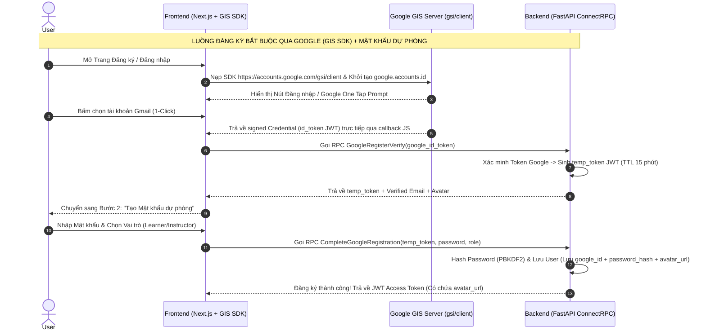

# 07. Kiến Trúc Xác Thực (AuthN) & Phân Quyền Hỗ Trợ Đa Tổ Chức (AuthZ & Direct ReBAC Matrix)

Tài liệu này mô tả chi tiết kiến trúc kỹ thuật Xác thực (Authentication) Stateless và Phân quyền theo mô hình **Tối Giản & Trực Tiếp (Static Role-Permission Matrix & Entity Method Check)**.

---

## 1. Tổng quan Kiến trúc Phân quyền 3 Lớp (3-Layer Security Model)

Hệ thống loại bỏ hoàn toàn các bảng cơ sở dữ liệu động lưu vai trò (`organization_roles`), đưa phân quyền về đúng **3 Lớp Thẩm định Bất khả Xâm phạm**:

1. **Layer 1 (API Method Policy & Auth Context Injection)**:
   * Mỗi ConnectRPC method trong `.proto` khai báo option `(auth.v1.policy)` (`AUTH_POLICY_PUBLIC`, `AUTH_POLICY_AUTHENTICATED`).
   * `AuthInterceptor` & `AuthPolicyRegistry` giải mã JWT token và nạp `CurrentUserContext` vào `contextvars`.
2. **Layer 2 (Database Query / SQL Scope Pushdown)**:
   * Đẩy điều kiện lọc tổ chức xuống tầng SQL query via `apply_organization_scope()` trong `backend/src/shared/infrastructure/scopes.py`.
3. **Layer 3 (Domain Ownership & Centralized ReBAC Matrix)**:
   * Mã hóa cứng bảng vai trò và quyền trong code (`backend/src/shared/permissions.py`).
   * Thẩm định quyền qua các Guard functions `enforce_organization_permission` và `enforce_course_ownership`.

---

## 2. Ma Trận Vai Trò & Quyền Tĩnh (Static ReBAC Matrices in `src/shared/permissions.py`)

### A. Phân quyền Tổ chức (Organization Level - `OrgRole` & `OrgPermission`)
- **Vai trò tĩnh (`OrgRole`)**: `OWNER`, `INSTRUCTOR`, `TA`, `MEMBER`.
- **Hành động (`OrgPermission`)**: `MANAGE_MEMBERS` (`org:manage_members`), `CREATE_COURSE` (`org:create_course`), `MANAGE_COURSES` (`org:manage_courses`), `VIEW_ANALYTICS` (`org:view_analytics`).
- **Bảng Ma trận Role-Permission (`ROLE_PERMISSIONS`)**:
  - `OWNER`: Toàn quyền (`MANAGE_MEMBERS`, `CREATE_COURSE`, `MANAGE_COURSES`, `VIEW_ANALYTICS`).
  - `INSTRUCTOR`: Có quyền `CREATE_COURSE`, `VIEW_ANALYTICS`.
  - `TA`: Có quyền `CREATE_COURSE`.
  - `MEMBER`: Không có quyền quản trị/tạo khóa học.

### B. Phân quyền Khóa học (Course Level - `CourseRole` & `CoursePermission`)
- **Vai trò tĩnh (`CourseRole`)**: `OWNER`, `CO_INSTRUCTOR`, `TA`.
- **Hành động (`CoursePermission`)**: `EDIT_DETAILS`, `MANAGE_CURRICULUM`, `SUBMIT_LAUNCH`, `DELETE_COURSE`, `MANAGE_COLLABORATORS`, `GRADE_ASSESSMENTS`.
- **Bảng Ma trận Role-Permission (`COURSE_ROLE_PERMISSIONS`)**:
  - `OWNER`: Toàn quyền trên khóa học.
  - `CO_INSTRUCTOR`: Quyền `EDIT_DETAILS`, `MANAGE_CURRICULUM`, `SUBMIT_LAUNCH`, `MANAGE_COLLABORATORS`, `GRADE_ASSESSMENTS`.
  - `TA`: Quyền `MANAGE_CURRICULUM`, `GRADE_ASSESSMENTS`.

---

## 3. Thẩm định Quyền Hạn trên Domain Entity & Guard Functions

### A. Guard Thẩm định Quyền Khóa học (`enforce_course_ownership`)
Mọi logic thẩm định quyền sở hữu, vai trò (`OWNER`, `CO_INSTRUCTOR`, `TA`), và trạng thái khóa học được thẩm định tập trung trong `enforce_course_ownership` (`backend/src/shared/permissions.py`), kết hợp hàm kiểm tra trạng thái trên Domain Entity (`course.can_edit`):

```python
class Course(Entity):
    def can_edit(
        self,
        user: Any,
        allow_read_only_pending: bool = False,
    ) -> bool:
        if not user or not getattr(user, "id", None):
            return False
        role = getattr(user, "role", "").upper()
        if "ADMIN" in role or role in ("USER_ROLE_ADMIN", "3"):
            return True
        if not allow_read_only_pending and self.status == CourseStatus.PENDING_REVIEW:
            return False
        return bool(
            (self.owner_id and user.id == self.owner_id)
            or (self.co_instructor_ids and user.id in self.co_instructor_ids)
            or (self.ta_ids and user.id in self.ta_ids)
        )
```

---

## 4. Cấu trúc Đối tượng Security Context (`CurrentUserContext`)

Thông tin định danh của User khi đăng nhập thành công được lưu trong `CurrentUserContext` (`backend/src/shared/auth.py`) thông qua `contextvars` per-request:

```python
@dataclass
class CurrentUserContext:
    id: str                 # User ID (sub)
    email: str = ""         # User Email
    full_name: str = ""     # User Full Name
    role: str = ""          # System Role (e.g. USER_ROLE_ADMIN, USER_ROLE_INSTRUCTOR, USER_ROLE_LEARNER)
```

---

## 6. Kiến Trúc Xác Thực Đăng Ký & Đăng Nhập Lai (Google Identity Services GIS SDK + Password Fallback)

Hệ thống triển khai cơ chế xác thực kép linh hoạt và an toàn cao, kết hợp giữa **Google Identity Services (GIS SDK)** chuẩn 2026 và **Mật khẩu dự phòng độc lập**:



### A. Lý Do Kỹ Thuật & Nghiệp Vụ Của Luồng Đăng Ký
1. **Xác minh Email chính chủ & Chống Bot/Spam (Anti-Spam Email Guarantee)**:
   - Bắt buộc đăng ký qua Google Identity Services (GIS SDK) nhằm đảm bảo 100% email là thật và thuộc về người dùng chính chủ.
   - Loại bỏ hoàn toàn chi phí duy trì dịch vụ gửi email OTP/Activation link (Resend, SendGrid, Amazon SES) và tránh rủi ro email bị rơi vào hộp thư Spam.
2. **Cơ chế Dự phòng Sự cố (Disaster Recovery & High Availability)**:
   - Việc bắt buộc tạo Mật khẩu phụ ngay lúc đăng ký đảm bảo **100% tài khoản trong DB đều có password_hash**.
   - Trong trường hợp dịch vụ Google bị sự cố (Google Outage) hoặc người dùng không lưu session Google, người dùng **vẫn đăng nhập bình thường bằng Email & Mật khẩu** mà không bị gián đoạn học tập.
3. **Đồng bộ Ảnh Đại diện Chính chủ (Google Avatar Synchronization)**:
   - Tự động trích xuất ảnh đại diện chính chủ từ Google (`picture` claim), lưu trữ vào PostgreSQL và nạp vào JWT Token payload (`avatar_url`).
   - Tự động đồng bộ hiển thị mượt mà trên Header Navbar (`UserDropdown`), Dropdown Menu, và Trang quản lý hồ sơ cá nhân.

### B. Danh Mục Công Nghệ & Thư Viện Sử Dụng (Technology Stack)
- **Frontend Stack**:
  - `Next.js 16` (React 19, Turbopack, Server Actions trong `src/app/auth/actions.ts`).
  - `Google Identity Services (GIS SDK)` (`https://accounts.google.com/gsi/client` & `google.accounts.id` API).
  - `@connectrpc/connect-web` giao tiếp RPC bất đồng bộ với Backend.
  - `AuthProvider` React Context quản lý Client Auth State & đồng bộ Avatar.
- **Backend Stack**:
  - `FastAPI` 0.115+ (Async I/O cho mọi tác vụ).
  - `ConnectRPC / gRPC` Service (`IdentityService`).
  - `Mã hóa Mật khẩu`: PBKDF2 HMAC SHA-256 (`hash_password` / `verify_password`).
  - `Mã hóa Session`: PyJWT mã hóa JWT Access Token (TTL 60m) & Refresh Token (TTL 7d) có chứa custom claim `avatar_url`.
- **Cơ sở dữ liệu (Database Stack)**:
  - `PostgreSQL` + `SQLAlchemy 2.0 Async`.
  - `Alembic Migration`: `f89a1029c001_add_google_id_to_users.py` quản lý cột `google_id` (Unique, Indexed).

---

## 7. Quy Tắc Thẩm Định Nghiệp Vụ Theo Đối Tượng

| Đối Tượng Nghiệp Vụ | Cơ Chế Thẩm Định | Chi Tiết Quy Tắc |
| :--- | :--- | :--- |
| **Chỉnh sửa / Quản lý Khóa học** | `enforce_course_ownership(course, user)` | Admin hệ thống HOẶC (`OWNER`, `CO_INSTRUCTOR`, `TA`). Khóa học ở trạng thái `PENDING_REVIEW` sẽ ở chế độ Chỉ đọc đối với Giảng viên. |
| **Quản lý Thành viên Tổ chức** | `enforce_organization_permission(session, user, org_id, OrgPermission.MANAGE_MEMBERS)` | Đòi hỏi vai trò `OWNER` của Tổ chức (hoặc Super Admin). |
| **Tạo Khóa học cho Tổ chức** | `enforce_organization_permission(session, user, org_id, OrgPermission.CREATE_COURSE)` | Đòi hỏi vai trò `OWNER`, `INSTRUCTOR`, hoặc `TA` của Tổ chức. |
| **Phê duyệt / Từ chối Khóa học** | `_is_admin(user)` | Chỉ Quản trị viên hệ thống (`USER_ROLE_ADMIN`). |
| **Quản lý Enterprise Seats** | `_is_admin(user)` | Chỉ Quản trị viên hệ thống (`USER_ROLE_ADMIN`). |
| **Duyệt Đơn Giảng viên** | `_is_admin(user)` | Chỉ Quản trị viên hệ thống (`USER_ROLE_ADMIN`). |
| **Duyệt Hỗ trợ Tài chính / Thu hồi Chứng chỉ** | `_is_admin(user)` | Chỉ Quản trị viên hệ thống (`USER_ROLE_ADMIN`). |
| **Kiểm duyệt Diễn đàn** | `_can_moderate(user)` | Quản trị viên hệ thống HOẶC Giảng viên / Trợ giảng phụ trách khóa học. |


