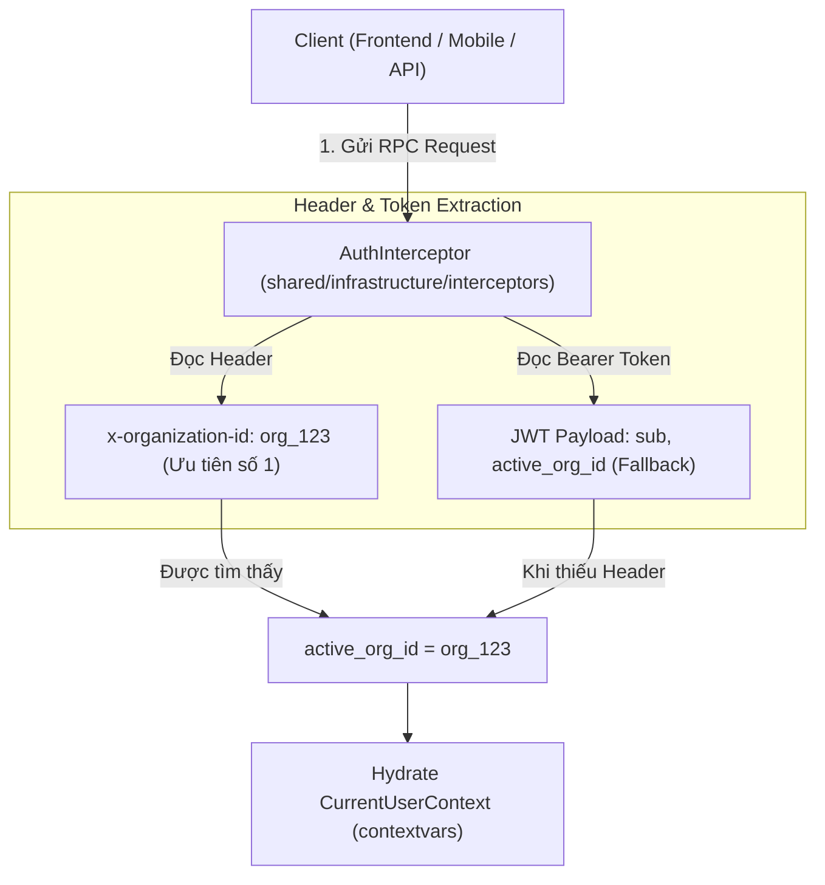

# 07. Kiến Trúc Xác Thực (AuthN) & Phân Quyền Hỗ Trợ Đa Tổ Chức (AuthZ & Multi-Org)

Tài liệu này mô tả chi tiết kiến trúc kỹ thuật Xác thực (Authentication), Phân quyền (Authorization), và cơ chế quản lý Ngữ cảnh Tổ chức (Organization Context) trong hệ thống.

---

## 1. Tổng quan Kiến trúc

Hệ thống áp dụng mô hình **Hybrid PBAC (Permission-Based Access Control) kết hợp SQL Scope Pushdown** hỗ trợ Multi-Tenancy / Multi-Organization:

* **Tách biệt Xác thực & Phân quyền**:
  * **AuthN**: Đăng nhập, verify JWT Access Token, trích xuất `user_id` và `system_role`.
  * **AuthZ**: Kiểm tra quyền truy cập tài nguyên dựa trên ngữ cảnh Tổ chức (`active_org_id`) và tập hợp Quyền hạn (`permissions`).
* **Không phụ thuộc thư viện phân quyền bên ngoài**: Triển khai 100% bằng thư viện chuẩn Python (`contextvars`, `dataclasses`) và tính năng có sẵn của `SQLAlchemy 2.0`.

---

## 2. Cơ Chế Truyền Ngữ Cảnh Tổ Chức (Organization Context & JWT Request Header)

### A. Vấn đề Multi-Tab trên Trình duyệt Web
Khi người dùng thuộc nhiều Tổ chức (ví dụ: vừa thuộc *Đại học Bách Khoa*, vừa thuộc *Coursera Project Network*):
* Nếu lưu cố định `active_org_id` duy nhất trong JWT Access Token (có thời hạn 60 phút), khi người dùng chuyển đổi Tổ chức ở Tab 2, Token mới sẽ làm cho Tab 1 bị lẫn lộn dữ liệu giữa 2 tổ chức (Lỗi *State Leakage / Race Condition* giữa các tab).

### B. Giải pháp Best Practice: Header-based Context với JWT Fallback
Hệ thống sử dụng cơ chế đính kèm Header kết hợp JWT Claim:



#### Quy tắc trích xuất Ngữ cảnh:
1. **Primary Source (Nguồn chính)**: Header `x-organization-id` (hoặc `X-Organization-Id`, `x-org-id`) trong Metadata của ConnectRPC request. Mỗi tab trình duyệt tự quản lý `organization_id` riêng trong State.
2. **Fallback Source (Nguồn dự phòng)**: Claim `active_org_id` trong JWT Access Token (dành cho API Client bên thứ 3 hoặc Mobile Client không gửi Header).
3. **Internal Default (Mặc định toàn sàn)**: Nếu không có cả Header lẫn Claim trong Token, `active_org_id` mặc định là `None` (hoặc `partner_community` đối với các thao tác khóa học công khai).

---

## 3. Cấu trúc Đối tượng Security Context (`CurrentUserContext`)

Toàn bộ thông tin xác thực và phân quyền của User được lưu trong `CurrentUserContext` (`backend/src/shared/auth.py`) thông qua `contextvars` per-request:

```python
@dataclass
class CurrentUserContext:
    id: str                                  # User ID (sub)
    email: str = ""                          # User Email
    role: str = ""                           # Legacy Role string (dùng cho tương thích ngược)
    system_role: str = "USER"                # SUPER_ADMIN | USER
    active_org_id: Optional[str] = None      # Organization ID hiện tại từ Header/Token
    org_role: Optional[str] = None           # Role trong Organization hiện tại (e.g. ORG_ADMIN, INSTRUCTOR)
    permissions: set[str] = field(default_factory=set)  # Tập hợp Permission trong Org hiện tại
```

### Các Phương thức Kiểm tra Quyền Hạn:
* `is_system_admin() -> bool`: Trả về `True` nếu user là Quản trị viên Toàn hệ thống (`SUPER_ADMIN`). Super Admin tự động có mọi quyền.
* `has_permission(permission: str) -> bool`: Kiểm tra user có sở hữu permission cụ thể (e.g. `course:create`, `course:publish`) hay không.
* `require_permission(permission: str) -> None`: Kiểm tra quyền, nếu không có sẽ ném lỗi `ConnectError(Code.PERMISSION_DENIED)`.
* `require_org_context() -> str`: Trả về `active_org_id`, nếu thiếu sẽ ném lỗi `ConnectError(Code.FAILED_PRECONDITION)`.

---

## 4. SQL Scope Pushdown (Phân quyền Tầng Database)

Đối với các API lấy Danh sách / Lọc / Tìm kiếm (ví dụ: `ListCourses`), hệ thống **không bao giờ** kéo dữ liệu về RAM để lọc.

Hàm `apply_organization_scope()` (`backend/src/shared/infrastructure/scopes.py`) tự động đẩy điều kiện lọc xuống câu SQL:

```python
def apply_organization_scope(stmt: Select, model_cls: Any, ctx: Optional[CurrentUserContext]) -> Select:
    if not ctx or ctx.is_system_admin():
        return stmt

    if ctx.active_org_id:
        return stmt.where(
            or_(
                model_cls.organization_id == ctx.active_org_id,
                model_cls.organization_id == INTERNAL_SYSTEM_ORG_ID,  # "partner_community"
            )
        )

    return stmt.where(model_cls.organization_id == INTERNAL_SYSTEM_ORG_ID)
```

✅ **Kết quả**:
* PostgreSQL thực thi câu lệnh SQL với chỉ mục Index `ix_courses_organization_id`.
* Đảm bảo tính chính xác 100% cho phân trang `LIMIT` / `OFFSET`.

---

## 5. Quy tắc Giảng viên Cá nhân & Organization Mặc định

* **Ràng buộc Khóa học 100% thuộc Organization**: Không tồn tại khóa học mồ côi (`organization_id NOT NULL`).
* **Coursera Project Network (`partner_community`)**:
  * Mã ID: `partner_community` (Hằng số `INTERNAL_SYSTEM_ORG_ID` trong `backend/src/modules/identity/domain/constants.py`).
  * Tên hiển thị: `Coursera Project Network`.
  * Slug: `coursera-project-network`.
  * Giảng viên cá nhân tự do sau khi được duyệt sẽ thuộc về Tổ chức mặc định toàn sàn này.
